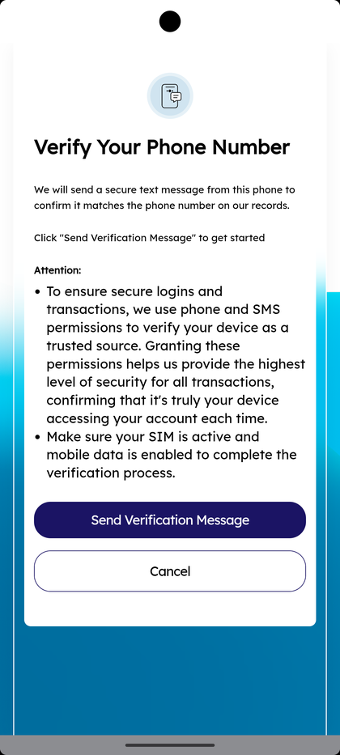
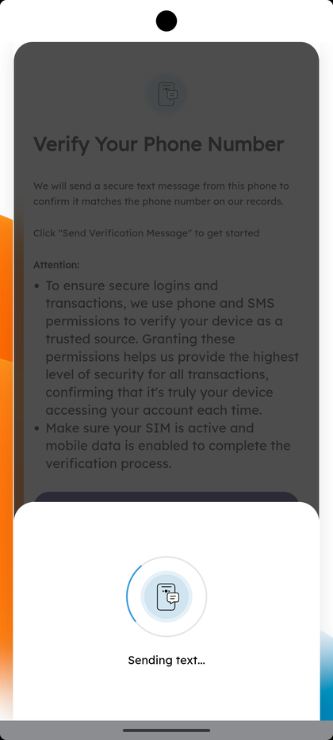

# Phone Verification & Device Trust

_Summerville Mobile › Authentication & Onboarding › Phone Verification & Device Trust_

## Authentication & Onboarding: Phone Verification & Device Trust

> The first time you log in on a new phone, the app sends a silent SMS from your device to confirm the SIM matches the number on record. This is what turns your phone into a "trusted" device and unlocks biometric login.

### Step-by-Step Workflow

#### Step 1: Verify Your Phone Number — Send Verification Message

When the verification flow starts, you'll see a card titled **Verify Your Phone Number** with the explanation *"We will send a secure text message from this phone to confirm it matches the phone number on our records. Click 'Send Verification Message' to get started."* Below is the important attention block: grant phone and SMS permissions when prompted, make sure your SIM is active, and ensure cellular data (not just Wi-Fi) is enabled. Tap **Send Verification Message** to proceed; **Cancel** exits without verifying.

#### Step 2: Sending Text…

The app initiates the outbound SMS and shows a **"Sending text…"** progress indicator. This usually takes a few seconds. If the SMS fails (e.g., Wi-Fi-only device, no SIM), you'll see an error rather than a completion.

### Summary

Device trust is the difference between a one-touch biometric login and a full OTP step-up on every session, so getting through this verification cleanly the first time saves friction for every subsequent login. Two common failure modes: SMS permissions denied (grant them in system settings and retry) and Wi-Fi-only devices that can't send an outbound text (this flow requires cellular — complete enrollment on your primary phone, then you can use other devices after that).

### Key Use Cases

* First-time enrollment on a personal phone: grant SMS permission, verification completes, the device becomes trusted for biometric login.
* Swapping SIMs or getting a new phone: the verification runs again automatically on first launch to re-trust the new device.
* Tablet or Wi-Fi-only device: verification will fail by design — enroll on your primary phone first.
