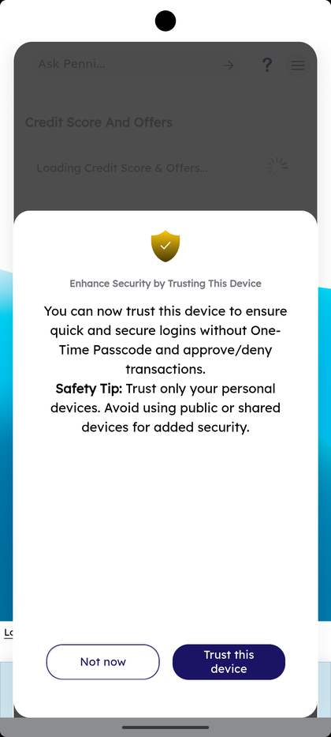
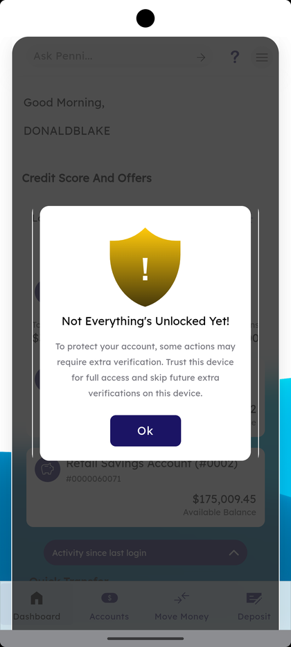

# Phone Verification & Device Trust

_Summerville Mobile › Authentication & Onboarding › Phone Verification & Device Trust_

## Authentication & Onboarding: Phone Verification & Device Trust

> The first-login security flow on a new phone. Step 1: Summerville asks whether to trust the device (promote it from "Remembered" to "Trusted" for biometric login and fewer OTP prompts later). Step 2–3: a silent SMS from your phone confirms the SIM matches the number on record. Step 4: a final "Not Everything's Unlocked Yet!" prompt closes the loop if any action needs extra verification.

**How to get here:** Appears automatically after your first successful login on a new device — you don't navigate here, it finds you

### Step-by-Step Workflow

#### Step 1: Trust This Device Prompt

Right after your first successful login on a new phone, the Dashboard loads and an overlay modal appears: a shield icon with a checkmark, heading *"Enhance Security by Trusting This Device"*, body text *"You can now trust this device to ensure quick and secure logins without One-Time Passcode and approve/deny transactions. Safety Tip: Trust only your personal devices. Avoid using public or shared devices for added security."* Two buttons: **Not now** (keeps the device as Remembered only) and **Trust this device** (promotes to Trusted).

#### Step 2: Verify Your Phone Number — Send Verification Message

After the trust decision, the **Verify Your Phone Number** card appears: *"We will send a secure text message from this phone to confirm it matches the phone number on our records. Click 'Send Verification Message' to get started."* Below is an Attention block explaining that phone and SMS permissions must be granted, and cellular data (not just Wi-Fi) must be enabled. Tap **Send Verification Message**; **Cancel** exits without verifying.

#### Step 3: Sending Text…

The app initiates the outbound SMS and shows a **"Sending text…"** loading indicator. Verification usually completes in a few seconds. If the SMS fails (Wi-Fi only, no SIM, permissions denied), the flow surfaces an error and you'll need to retry after resolving the underlying issue.

#### Step 4: "Not Everything's Unlocked Yet!" (Final Prompt)

If there are any remaining actions that still need elevated trust — or if you tapped **Not now** back in Step 1 and then tried a high-value action — a final prompt appears: gold shield icon with *"Not Everything's Unlocked Yet! To protect your account, some actions may require extra verification. Trust this device for full access and skip future extra verifications on this device."* with an **Ok** button. Tap **Ok** to promote the device now so you don't hit the prompt again on the next action.

### Summary

The flow has a reason for its order: the trust-device prompt comes first because Summerville wants you to make the "is this really my phone" decision up front, before any SMS even leaves the device. Phone verification is the second layer — it proves the SIM in the phone matches your account regardless of whether you trusted the device or not. The "Not Everything's Unlocked Yet!" prompt at the end is the safety net for members who picked **Not now** in Step 1 and later run into a feature that needs elevated trust; it offers a second chance to promote the device without going back to Settings. Always trust your personal phone; never trust a shared device.

### Key Use Cases

* First-time setup on a new personal phone: tap **Trust this device** in Step 1, complete verification, and you're set — no further OTP prompts for everyday actions.
* First-time setup on a borrowed or shared device: tap **Not now** in Step 1 → device stays Remembered only → expect OTP on every login and high-value action.
* Member tapped **Not now** earlier and now wants full access: the Step 4 prompt appears next time they try a gated action — tap **Ok** to promote.
* Swapping SIMs or getting a new phone: the whole flow runs again on the new device.
* Revoke a trusted shared device later: Profile → Personal Information → Manage Devices → Forget.
