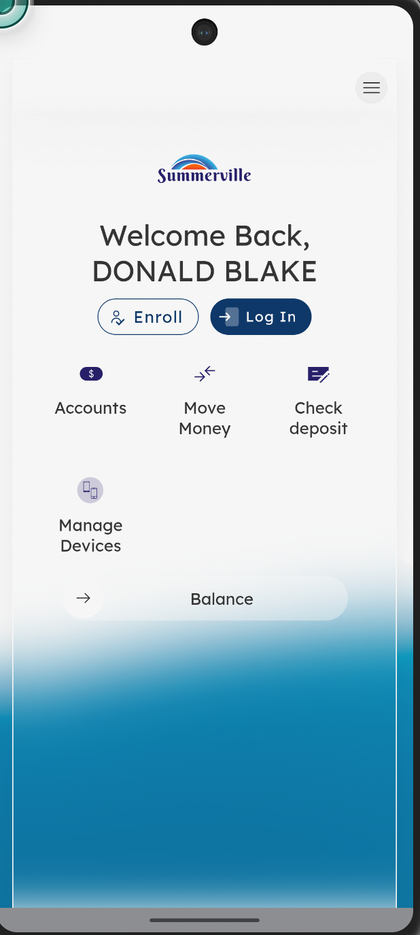
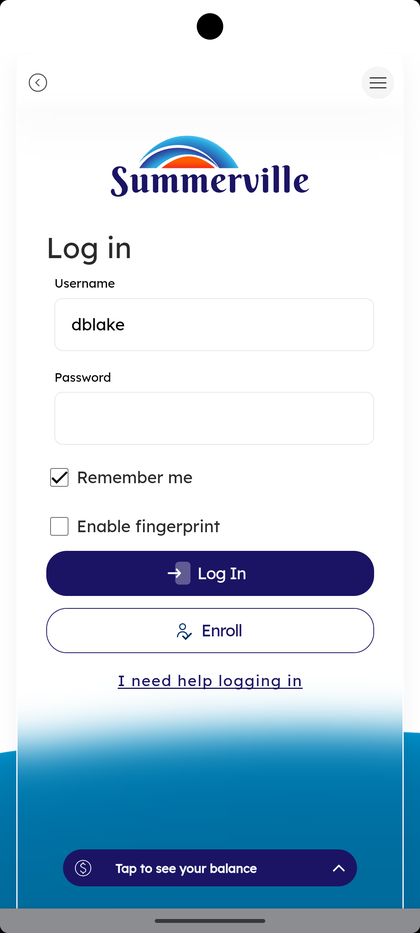
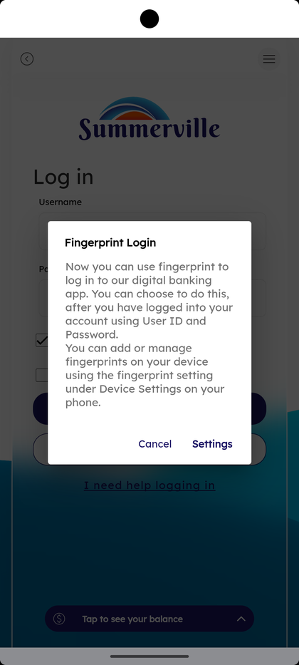
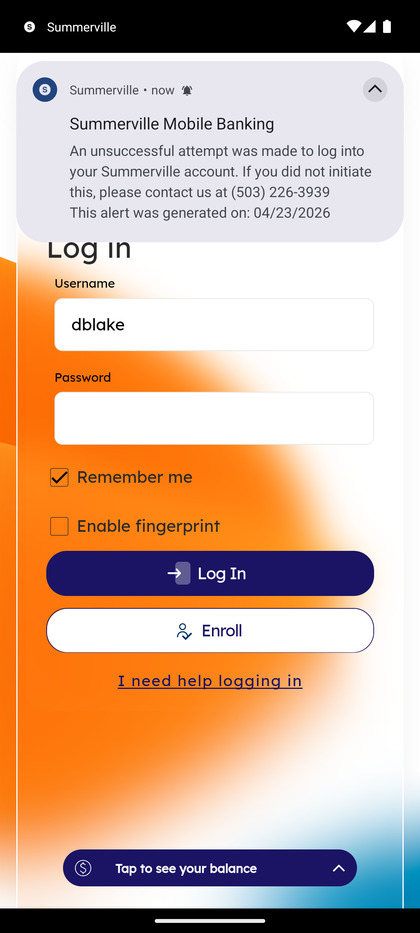

# Welcome & Login

_Summerville Mobile › Authentication & Onboarding › Welcome & Login_

## Authentication & Onboarding: Welcome & Login

> The first screens you see every time you open the app — the pre-login welcome with quick shortcuts, the Log In form itself, and the fingerprint-activation prompt that offers biometric login once you're in.

**How to get here:** Open the Summerville Mobile app (this is the first screen you see, logged out)

### Step-by-Step Workflow

#### Step 1: Welcome Screen (Pre-Login)

When you open the app while logged out, the welcome screen greets you by name (if you've logged in before): *"Welcome Back, DONALD BLAKE"*, with **Enroll** and **Log In** buttons at the top. Below are four quick shortcuts you can tap without fully logging in: **Accounts**, **Move Money**, **Check deposit**, and **Manage Devices**. The **Balance** chip at the bottom shows a quick balance peek on a single tap.

#### Step 2: Log In Screen

Tap **Log In** on the welcome screen. The Log In form appears — the Summerville logo at the top, then two fields: **Username** (remembered from last time, e.g., *dblake*) and **Password**. Below the fields: a **Remember me** checkbox (ticked by default so you skip the username entry next time) and **Enable fingerprint** checkbox (if your phone supports it). Main action is **Log In**. Below it: **Enroll** if you haven't enrolled in digital banking yet, and *"I need help logging in"* for credential recovery. The **Tap to see your balance** chip at the bottom is the same one-tap balance peek from the welcome screen.

#### Step 3: Fingerprint Activation Prompt (First Login After Enroll)

On your first login after enrolling, a prompt appears: *"Fingerprint Login — Now you can use fingerprint to log in to our digital banking app. You can choose to do this, after you have logged into your account using User ID and Password. You can add or manage fingerprints on your device using the fingerprint setting under Device Settings on your phone."* **Settings** opens your phone's biometric settings; **Cancel** dismisses. After this is set up, you can tick **Enable fingerprint** on the Log In screen to skip password entry on future logins.

#### Step 4: Security Alert on Log In (When It Happens)

If there's been a recent unsuccessful login attempt on your account, the Log In screen shows a Summerville Mobile Banking banner at the top: *"An unsuccessful attempt was made to log into your Summerville account. If you did not initiate this, please contact us at (503) 226-3939"* plus the date. Read it before logging in — if the attempt wasn't you, call the fraud line before entering credentials.

#### Step 5: After Login — OTP Step-Up (If Device Not Trusted)

If you're logging in on a phone that hasn't been promoted to "Trusted" (see Trust This Device), a One-Time Passcode step appears after you tap Log In. Enter the 6-digit code that's sent to your phone-on-file and tap Verify. Trusted devices skip this step on every subsequent login.

*Note: an OTP-entry screenshot isn't included in this capture set — if the OTP always appears on first-time logins, capture it on a fresh install and this section will be updated with a real screen.*

### Summary

Login on Summerville Mobile is intentionally fast — Remember Me skips username entry, Enable fingerprint skips password entry, and Trust This Device skips OTP. A brand-new device goes through all three step-ups once; after that, you usually open the app and see your Dashboard within two seconds. The security alert banner is the FI's way of surfacing potentially-suspicious login attempts to you before you authenticate — it's often the first signal of a credential leak, and the fraud phone number is right there in the banner so you don't have to look it up.

### Key Use Cases

* Returning member checking a balance at a glance: tap **Balance** on the welcome screen — no login required.
* First-time enrollment: tap **Enroll** on the welcome screen and proceed through membership verification.
* Member sees an unsuccessful-login banner: confirm it wasn't them, call the fraud number listed, then reset credentials from "I need help logging in".
* Enable biometrics after first login: accept the Fingerprint Login prompt or return to it from Profile → Personal Information → Manage Devices.
