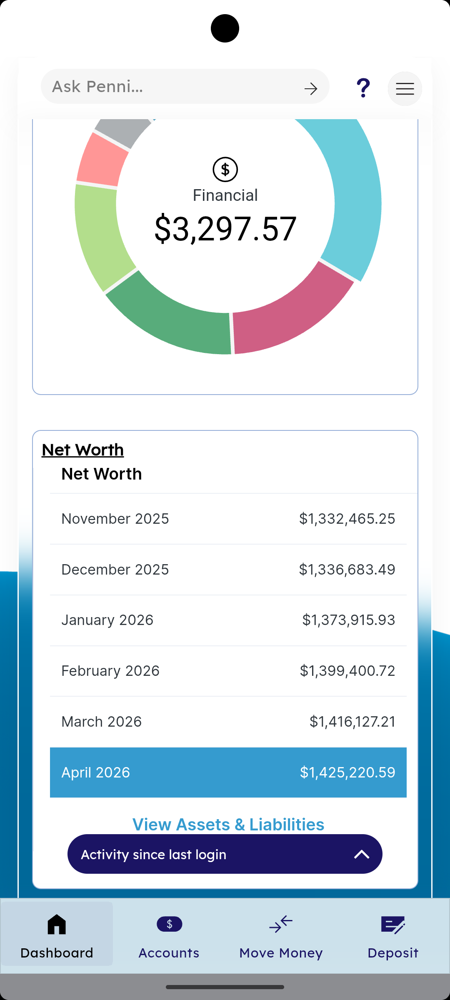

# Home & Insights

_Summerville Mobile › Dashboard › Home & Insights_

## Dashboard: Home & Insights

> The post-login landing — Financial summary donut, Net Worth trend, and "Activity since last login" — is engineered to answer the three questions members open the app for: what's my balance, what's my trajectory, and what happened while I was away.

### Step-by-Step Workflow

#### Step 1: Financial Summary Donut

The donut chart at the top of the Dashboard aggregates all eligible balances into a single **Financial** total (e.g., $3,297.57 shown in the capture), with wedges color-coded by account category. The **Ask Penni…** virtual-assistant bar sits above the chart so members can ask balance and transaction questions in natural language without drilling into the Accounts tab.

#### Step 2: Net Worth Trend

Below the donut, the **Net Worth** card shows the last 6 months of total net worth with the current month highlighted (e.g., April 2026 — $1,425,220.59). Tap **View Assets & Liabilities** to drill into the breakdown that feeds this number, which is the entry point to the Financial Wellness experience powered by MX or equivalent aggregator.

#### Step 3: Activity Since Last Login

The collapsible **Activity since last login** tray at the bottom of the main Dashboard card surfaces transactions, alerts, and messages that appeared between the member's previous session and this one. This is intentionally the first thing below Net Worth because returning members want to see what changed, not re-read what they already knew.

#### Step 4: Feedback Prompt (Periodic)

A **Feedback** rating sheet surfaces periodically on the Dashboard asking *"How would you rate your mobile banking experience?"* with a 5-point face-scale (sad → love). **Not Now** dismisses without rating and the prompt won't re-surface in the current session. Ratings feed the in-app NPS pipeline; the prompt is rate-limited per member so it doesn't become intrusive.

### Summary

The Dashboard is deliberately narrow in scope: total balance, net worth, and session-delta activity — everything else is one tab-tap away. The Ask Penni bar, the donut, and Activity-since-last-login are the three signals that do the most work for returning members, and they're all above the fold on a standard phone viewport. The feedback sheet is a low-friction satisfaction signal that populates NPS without a survey email, but because it interrupts the home screen it's rate-limited server-side.

### Key Use Cases

* Daily balance check: open app → biometric login → Dashboard shows total balance in the donut, no further taps needed.
* Member wants to understand net worth change: tap **View Assets & Liabilities** to see which account moved.
* Returning after a week away: **Activity since last login** surfaces pending transactions, alerts, and messages in one collapsible section instead of four separate tabs.
