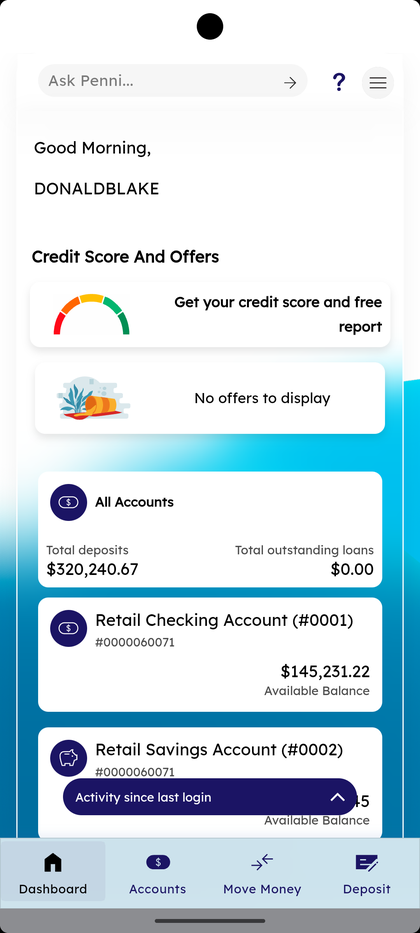
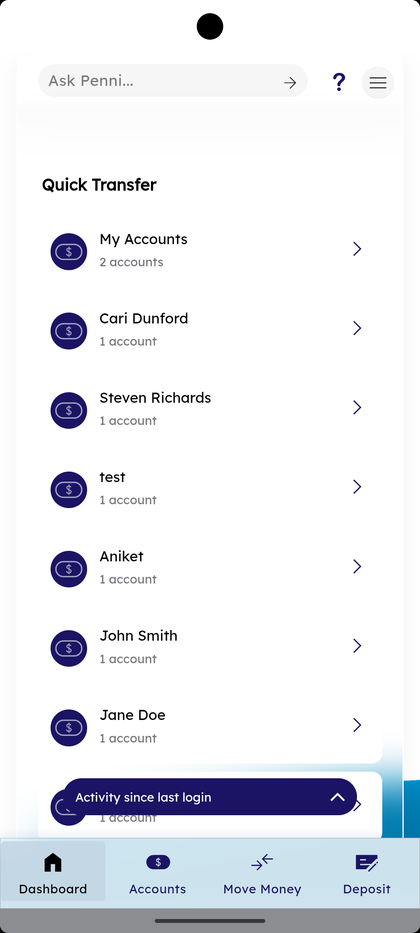
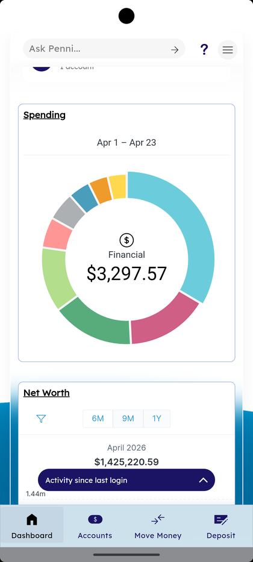
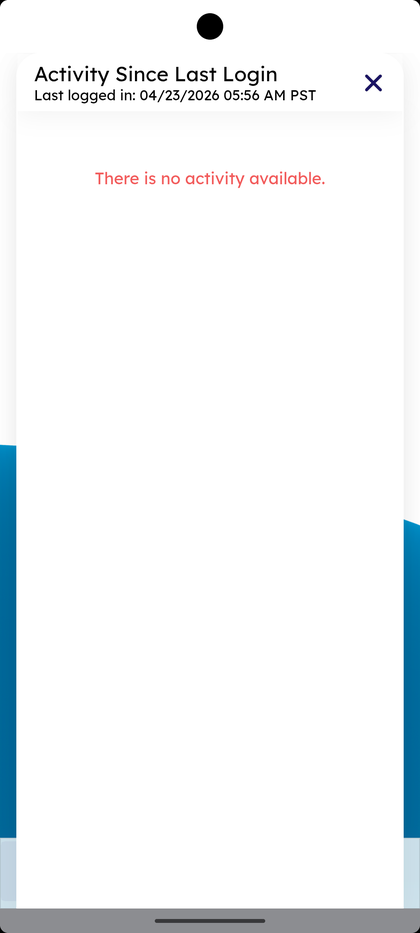

# Home & Insights (Dashboard)

_Summerville Mobile › Dashboard › Home & Insights_

## Dashboard: Home & Insights

> The Dashboard is what loads after every login. It's built to answer the three things members open the app for: "what's my balance," "how's my spending trending," and "what happened since I last looked." Three scrollable sections — Quick Transfer, Spending donut, and Net Worth — with an Activity Since Last Login summary pinned at the bottom.

### Step-by-Step Workflow

#### Step 1: Top of Dashboard — Greeting + Credit Offers + All Accounts Summary

Scrolling to the top of the Dashboard, you'll see the **Ask Penni…** assistant bar, a greeting (*"Good Morning, DONALDBLAKE"*), a **Credit Score And Offers** card with a quick credit-score widget and an offers list (*"No offers to display"* when there aren't any), and an **All Accounts** summary card showing **Total deposits** and **Total outstanding loans** at a glance. Tap into any of these for deeper views.

#### Step 2: Quick Transfer List

Below the summary is the **Quick Transfer** section. It lists your accounts and any saved recipients as tappable rows (**My Accounts — 2 accounts**, then individual saved people like **Cari Dunford — 1 account**, **Steven Richards**, **test**, **Aniket**, **John Smith**, **Jane Doe**). Tapping any row jumps straight into a pre-filled Transfer Funds form — it's the fastest path to a repeat transfer without navigating through the Move Money tab.

#### Step 3: Spending Donut

Scroll further and the **Spending** card appears with a colorful donut chart covering the current period (e.g., *"Apr 1 – Apr 23"*). The donut segments show your spending by category. The center shows the total — **Financial** with the amount (e.g., *$3,297.57*). This is the primary spending-insights visualization members open to answer "where did my money go."

#### Step 4: Net Worth Trend

Below the Spending donut is the **Net Worth** card. A time-range filter lets you pick **6M / 9M / 1Y** of history; the line plots net worth over time and highlights the current month (e.g., *April 2026 — $1,425,220.59*). The full breakdown behind this number is available via *"View Assets & Liabilities"*.

#### Step 5: Activity Since Last Login

At the bottom of every Dashboard section is a navy pill: **"Activity since last login"**. Tap it to open the full-screen modal: *"Activity Since Last Login — Last logged in: [date and time]"*. If nothing happened between sessions, the modal shows *"There is no activity available."* If there were transactions, alerts, or messages, they appear here. Tap **✕** to close and return to the Dashboard.

### Summary

The Dashboard is deliberately narrow: a greeting, a shortcut-to-action Quick Transfer list, a spending insight, a net-worth trend, and a session-delta activity summary. Everything else is one tab-tap away (Accounts, Move Money, Deposit) or inside the Side Menu. The Quick Transfer list is the underrated power feature — if you repeat the same transfer often, pinning it from the Dashboard is one tap vs. three. Activity Since Last Login is the "what did I miss" view and is safe to open every time.

### Key Use Cases

* Daily balance check: open the app → biometric login → Dashboard loads → **All Accounts** card shows totals above the fold.
* Repeat transfer to a known recipient: Dashboard → tap their row in **Quick Transfer** → confirm amount → send.
* Weekly spending review: scroll to **Spending** donut → tap a segment to see transactions in that category.
* Returning after a week away: tap **Activity since last login** to see what changed between sessions.
