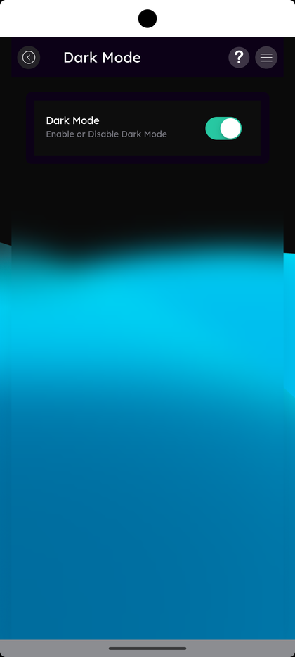

# Light & Dark Theme

_Summerville Mobile › Dashboard › Light & Dark Theme_

## Dashboard: Light & Dark Theme

> A member-controlled visual preference. The Side Menu lists **Dark Theme** as the entry; tapping it opens the Dark Mode picker which is a single on/off toggle. When enabled, every surface in the app flips to a dark navy palette.

**How to get here:** Side Menu (☰) → **Dark Theme** (near the bottom)

### Step-by-Step Workflow

#### Step 1: Open the Side Menu

Tap the **☰** hamburger icon at the top-right of any screen.

#### Step 2: Scroll Down to Find Dark Theme

Scroll the Side Menu past the main navigation rows to the secondary area. **Dark Theme — Enable or Disable Dark Theme** is near the bottom, just above Log out.

#### Step 3: Toggle Dark Mode On/Off

The **Dark Mode** screen opens with a single row: **Dark Mode — Enable or Disable Dark Mode** with a toggle on the right. The screen itself is rendered in the dark palette (navy header, dark backgrounds), so when you flip the toggle on, the rest of the app immediately matches. Tapping the toggle off returns the app to the light palette.

### Summary

The picker is intentionally minimal — one toggle, one preference, applied immediately. There's no separate "System" mode in the current build (unlike many other apps) — Dark Mode is fully member-controlled. The choice is stored on the device, so reinstalling the app or moving to a new phone resets it to the light default. Brand colors (signature blue accents, navy headers) are preserved across both palettes so the Summerville identity stays consistent.

### Key Use Cases

* Member prefers dark mode at night for less eye strain: toggle on once, every session loads dark.
* Accessibility need for high contrast: pin Dark on regardless of OS-level setting.
* Member tries dark mode and prefers light: toggle off, app reverts immediately.
