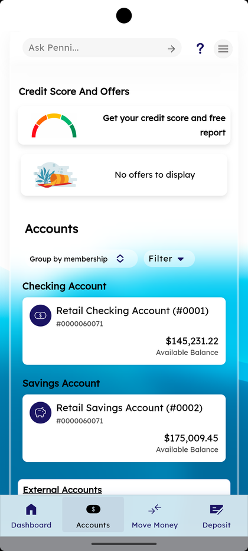
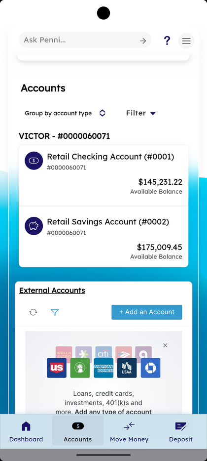
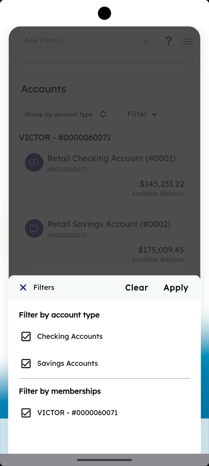

# Accounts Dashboard & Filters

_Summerville Mobile › Accounts › Dashboard & Filters_

## Accounts: Dashboard & Filters

> The Accounts tab is your daily-driver view of every account you hold — Summerville accounts at the top, linked external accounts below. Filter controls let you narrow by account type or membership without leaving the screen.

**How to get here:** Bottom navigation → **Accounts**

### Step-by-Step Workflow

#### Step 1: Open the Accounts Tab

From the bottom navigation, tap **Accounts**. The screen shows your holdings grouped by default. At the top: an **Ask Penni…** assistant bar. Below: a **Group by account type** toggle (tap to switch to Group by membership) and a **Filter ▾** button. Your accounts appear in cards organized by **Checking Account**, **Savings Account**, etc. Each card shows the account name, masked member number, and **Available Balance** (e.g., *Retail Checking Account (#0001) — $145,231.22*).

#### Step 2: Group By Membership (Alternative View)

Tap the **Group by account type ⇵** toggle to switch to **Group by membership**. Accounts re-group under each membership header (e.g., *VICTOR - #0000060071*). This view is most useful when you have multiple memberships and want to see everything under each member number together rather than all checking accounts together.

#### Step 3: Apply Filters

Tap **Filter ▾** to open the filter bottom sheet. Two filter groups appear:
- **Filter by account type** — tick **Checking Accounts** and/or **Savings Accounts**.
- **Filter by memberships** — tick the specific member numbers you want to include (e.g., **VICTOR - #0000060071**).

Tap **Apply** to narrow the view, **Clear** to reset all filters back to defaults.

### Summary

Filters persist for the current session so a business member filtering to their LLC doesn't re-apply it every time they return. **Group by account type** is the right default mental model for most members (checking → savings → CD); **Group by membership** helps members who hold multiple memberships (joint + business, for example) think in terms of "this member, these accounts." The filter sheet covers 95% of narrowing needs; for deeper search, drilling into a specific account is the next step.

### Key Use Cases

* Member with multiple joint memberships: Filter by membership to show only accounts tied to a single member number.
* Business owner checking just their operating checking balance: Filter to Checking Accounts only.
* Clearing a stale filter: tap **Clear** in the filter sheet header to return to the unfiltered default view.
