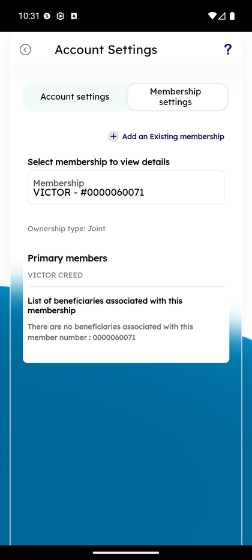

# Add a Membership

_Summerville Mobile › Accounts › Add a Membership_

## Accounts: Add a Membership

> Link a second Summerville membership (for example, a business LLC membership, a joint account with a family member) to your login so everything lives in one app.

**How to get here:** Side Menu (☰) → **Settings** → **Membership settings** tab → **+ Add an Existing membership**

### Step-by-Step Workflow

#### Step 1: Open the Side Menu

From any screen, tap the **☰** hamburger icon at the top-right. The Side Menu drawer slides in with your profile card at the top and navigation rows below.

#### Step 2: Tap Settings

In the Side Menu, tap **Settings — Account and security settings** near the top of the menu list.

#### Step 3: Switch to the Membership Settings Tab

On the Settings screen, two tabs appear at the top: **Account settings** (active by default) and **Membership settings**. Tap **Membership settings**.

#### Step 4: Tap + Add an Existing Membership

On the Membership Settings view, tap the **+ Add an Existing membership** link near the top. This opens the 2-step Add Membership wizard.

#### Step 5: Enter the Membership Number (Step 1 of 2)

The wizard asks you to *"Enter a membership to add to your account"* — type the membership number (e.g., *123456789*) in the input field and tap **Next**.

#### Step 6: Verify Ownership (Step 2 of 2)

The app validates the number against the core system and presents a short identity challenge. Complete it to attach the membership; once saved, the new membership appears in the Accounts tab filter and (if a business membership) in the Profile Switcher.

### Summary

Adding a membership is a verify-then-attach flow, not a self-service "any-number-works" linkage. The core-system check in Step 6 is the control that prevents someone from attaching a stranger's membership to their own login. Once attached, the new membership appears in the Accounts tab filter (**Group by membership**), in the Profile Switcher (if it's a business membership), and any entitlements (signer authority, business admin role) flow through from the core record automatically.

### Key Use Cases

* Consumer member who also has a business membership at Summerville: add the business membership number to see both in one app.
* Signer added to a family member's account: after the core flags them as a signer, add the membership here to get the access the role allows.
* Wrong number entered: Step 6 rejects the attempt — back up to Step 5 and re-enter.
