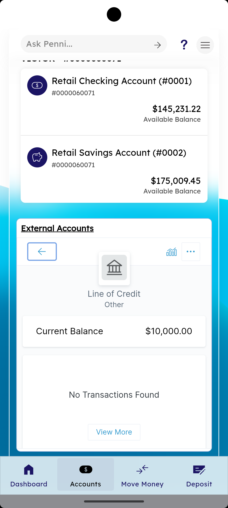

# External Accounts

_Summerville Mobile › Accounts › External Accounts_

## Accounts: External Accounts (Linked Non-Summerville Accounts)

> A dedicated section at the bottom of the Accounts tab that aggregates accounts you've linked from other banks and institutions (Chase, IQ Bank, your credit card, your mortgage, etc.) — one unified view of your financial life. Link new ones, see groupings, drill into details, and use the per-row overflow menu to manage.

### Step-by-Step Workflow

#### Step 1: Find the External Accounts Section

Open the **Accounts** tab. Scroll past your Summerville holdings (Retail Checking, Retail Savings) — the **External Accounts** section starts with an underlined header. Shortly below you'll see a row of institution logos (US Bank, AmEx, Citi, Chase, USAA, etc.) and a **+ Add an Account** button. If you've already linked accounts, they appear in grouped cards.

#### Step 2: View Grouped Externals

When externals are grouped, each group (e.g., **Other**) has a total amount and individual rows beneath it — like **Line of Credit — Tyfone Test — $10,000.00**, **Mortgage — $215,000.00**, **Used Automobile — $15,000.00**, **Visa Classic A+ — $9,573.02**. The section header and group total make it easy to see your full exposure at a glance.

#### Step 3: Link a New External Account

Tap **+ Add an Account**. The **Add Accounts** screen asks *"Select your institution"* with a search bar and suggestions (e.g., **MX Bank**). Type the bank or card issuer's name or pick from the grid. This hands off to the account-aggregator (MX) to authenticate with the external institution and establish a read-only link.

#### Step 4: Open the External Accounts Filter

Tap the **filter icon (funnel)** above the External Accounts list to open the filter sheet. Tick categories (ALL / CHECKING), specific external institutions (*Business Checking — Tyfone Test*, *Retail Checking — Tyfone Test*, etc.). Tap **Apply** to narrow; **←** returns to the full list.

#### Step 5: Drill Into a Single External Account

Tapping an external account opens its detail card — e.g., **Line of Credit — Other** with **Current Balance $10,000.00**. A small transaction feed appears if the aggregator returned transactions, or *"No Transactions Found"* with a **View More** button otherwise. Some products (straight lines of credit, closed accounts) don't expose transaction history, so the empty state is expected.

#### Step 6: Per-Account Overflow Menu

Tap the **⋯** (three-dot) menu on any external account card to open the quick-action sheet:
- **Edit Details** — update nickname or category.
- **Mark as Business** — flag the account for business-view filtering.
- **Mark as Duplicate** — hide it from totals if the aggregator returned it twice.
- **Mark as Closed** — archive an account that's been closed externally.
- **Hide Account** — remove from default views without deleting the link.
- **Close Menu** — dismiss.

### Summary

External Accounts is the aggregation layer — it turns Summerville Mobile into a "see everything in one place" app rather than a Summerville-only view. Balances contribute to Dashboard Net Worth; externals can be picked as source or destination in the Transfer Funds picker (showing up automatically after you link them). The per-row overflow menu handles the real-world cleanup cases: aggregator duplicates (mark duplicate), legacy closed accounts (mark closed), and accounts you don't want cluttering your main view (hide). Summerville never moves money out of a linked external account without an explicit transfer you initiate; the link is read-only for the aggregator.

### Key Use Cases

* Consolidate a multi-bank setup: link each external, see all balances in one place alongside your Summerville accounts.
* Set up regular transfers from an external: link it first, then the external appears as a transfer source in Move Money.
* Aggregator returned a duplicate row: **⋯** on the duplicate → **Mark as Duplicate** — it disappears from totals.
* Account closed at the external bank but still showing: **⋯** → **Mark as Closed** — archives the row.
