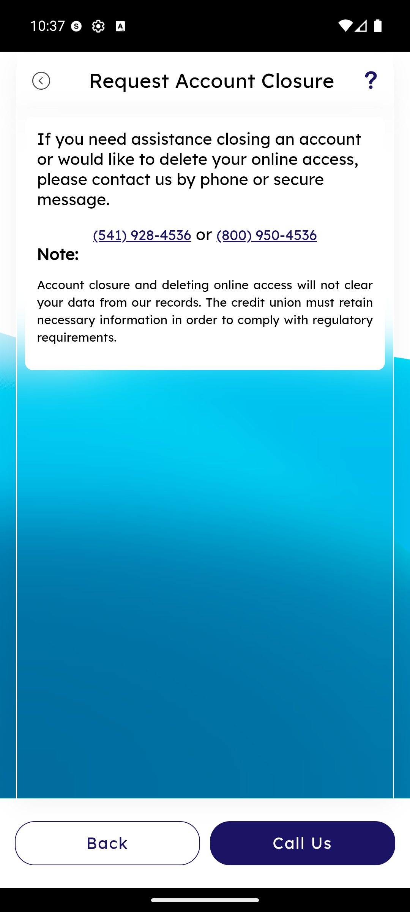

# Request Account Closure

_Summerville Mobile › Accounts › Request Account Closure_

## Accounts: Request Account Closure

> Account closure is not a self-service tap-to-close flow. Start from Side Menu → More Options; the screen explains the policy and routes you to the phone line that actually closes accounts.

**How to get here:** Side Menu (☰) → **More Options** → **Close Account**

### Step-by-Step Workflow

#### Step 1: Open the Side Menu → More Options

From any screen, tap **☰** at the top-right to open the Side Menu. Tap **More Options**.

#### Step 2: Tap "Close Account"

The **More Options** screen has six rows. Scroll to the bottom and tap **Close Account**. This opens the Request Account Closure screen.

#### Step 3: Read the Policy and Tap Call Us

The Request Account Closure screen opens with the routing text: *"If you need assistance closing an account or would like to delete your online access, please contact us by phone or secure message."* Two phone numbers are shown: **(541) 928-4536** and **(800) 950-4536**. A note block explains: *"Account closure and deleting online access will not clear your data from our records. The credit union must retain necessary information in order to comply with regulatory requirements."* Tap **Call Us** to auto-dial from your phone; **Back** exits if you change your mind.

### Summary

Closure is handled off-app by policy — the BSA/AML retention obligations and the irreversibility of the action make a live-agent conversation the right control, and this screen keeps members from ending up in the wrong self-service flow when their real intent is to close. The plain-language note about data retention heads off the common "but I asked you to delete me" conversation that drives complaints if it surfaces after the fact. The same screen also covers "delete my online access" — the two are handled by the same routing, because they often come up together.

### Key Use Cases

* Member ready to close today: Side Menu → More Options → Close Account → tap **Call Us** to speed-dial the closure line.
* Member confused closure with unenrollment: **Back** returns to More Options; if they just want to remove digital access, the same call handles it.
* Member says they want all data deleted: the note on this screen explains retention requirements — members often realize they don't need to close after reading it.
