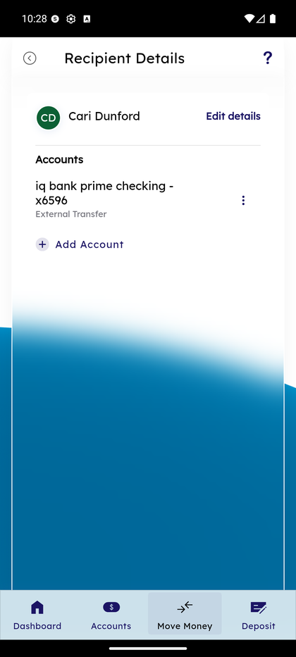
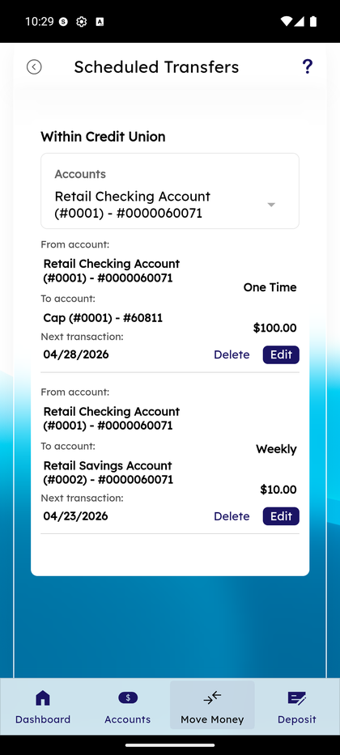

# Add Recipient

_Summerville Mobile › Move Money › Add Recipient_

## Move Money: Add Recipient (New Personal Recipient)

> Create a new personal recipient from Manage Recipients. A single form captures payment type (Within Summerville / External), name, nickname, and account type; you save their first account here and can add more accounts later from Recipient Details.

**How to get here:** Bottom navigation → **Move Money** → **Manage Recipients** → **+ New**

### Step-by-Step Workflow

#### Step 1: Open Add Recipient

From **Move Money → Manage Recipients**, tap **+ New** at the top of the All Recipients screen. The **Add Account** sheet opens.

#### Step 2: Pick Payment Type

At the top of the form, tap the **Payment type** dropdown. Two options: **Within Summerville** (another Summerville member — settles instantly via the core) or **External** (a person or account at a different financial institution — ACH or FedNow). Pick one; this choice drives which fields appear in the rest of the form.

#### Step 3: Fill Name, Nickname, Account Type

Complete the remaining fields:
- **Enter first name (optional)** — the recipient's legal first name.
- **Enter last name** — required.
- **Recipient Nickname** — a friendly label shown across the app (e.g., *"Landlord"*, *"Mom"*).
- **Enter account type** — dropdown with Checking, Savings, etc.

For **External** payment types, additional fields appear for routing number, account number, and institution details. For **Within Summerville**, the fields are fewer since the core handles the routing.

#### Step 4: Tap Add Recipient

With the form completed, tap **Add Recipient** at the bottom right. The recipient is created with this first account attached and appears immediately in the Transfer Funds recipient picker across the app. To add more accounts to the same recipient, open their Recipient Details from Manage Recipients and tap **+ Add Account**.

### Summary

Add Recipient is deliberately a one-screen form — a single recipient with a single first account gets created in one save. If you want multiple accounts for the same person (personal checking + savings + credit card), do that as a second step from Recipient Details rather than trying to cram it all into the initial create. The Within Summerville / External split is the most important choice on the form — it determines whether the recipient settles instantly (Within Summerville) or takes ACH timing (External) when you transfer to them later.

### Key Use Cases

* Add a new landlord (external): Payment type = External → fill name, nickname, routing/account → Add Recipient.
* Add a family member who also banks at Summerville: Payment type = Within Summerville → name + nickname + their member account info.
* Add someone with multiple accounts: create them with their first account here, then add others from Recipient Details.
