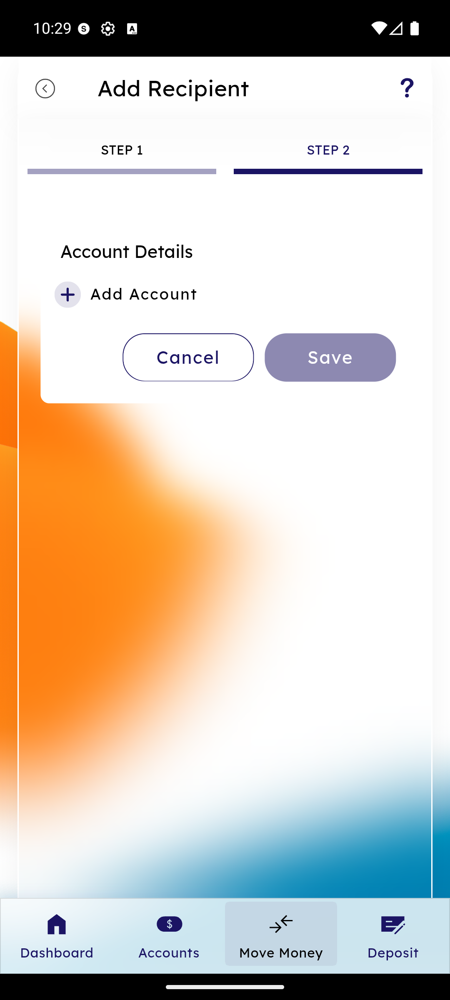

# Add Recipient

_Summerville Mobile › Move Money › Add Recipient_

## Move Money: Add Recipient

> Two-step wizard to attach an external person or account the member will send to repeatedly — Step 1 captures the recipient identity, Step 2 captures the funding account details.

### Step-by-Step Workflow

#### Step 1: Account Details — Add Account

Step 2 of the wizard (Step 1 captured the recipient's name) is the **Account Details** entry. Tap **+ Add Account** to open the account-number/routing-number form; **Save** is greyed out until at least one account is attached, which prevents an empty recipient from being created.

### Summary

Recipient creation is deliberately two-step so the member can save a partial draft at the identity step without committing incomplete banking details — this matches how real-life recipient setup happens when the member is texting a friend for their routing number mid-flow. The greyed-out Save is the guardrail that prevents a half-formed recipient from landing in the main picker and causing transfer failures.

### Key Use Cases

* Member adding a landlord: Step 1 captures name and contact, Step 2 holds until the landlord sends back routing/account numbers.
* Member attaching a second account for themselves at another bank: single recipient record, multiple accounts under it.
* Member accidentally skips Step 2: Save button stays greyed, visually flagging the missing account detail.
