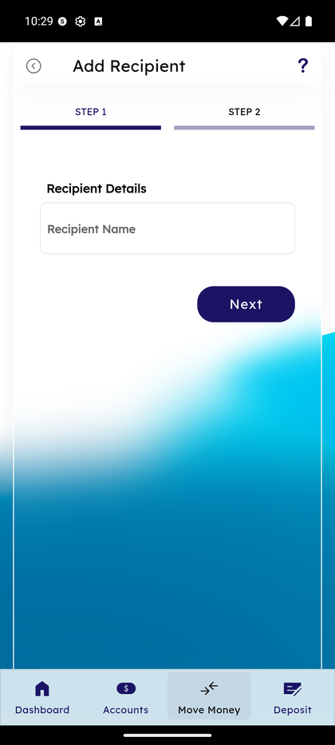
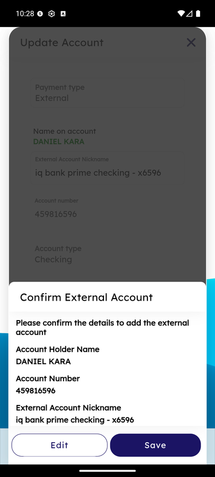

# Add Recipient

_Summerville Mobile › Move Money › Add Recipient_

## Move Money: Add Recipient (New Personal Recipient)

> Create a new personal recipient from Manage Recipients. Two steps: **Step 1** captures the recipient's name; **Step 2** captures payment type (Within Summerville / External) and the first account. After save, add more accounts from Recipient Details.

**How to get here:** Bottom navigation → **Move Money** → **Manage Recipients** → **+ New**

### Step-by-Step Workflow

#### Step 1: Open Manage Recipients → + New

From Move Money → Manage Recipients, tap **+ New** at the top of the All Recipients screen. The **Add Recipient** wizard opens at Step 1.

#### Step 2: Add Recipient Step 1 — Recipient Details

The first step of the wizard asks for **Recipient Details** — enter the **Recipient Name** in the single input field. Tap **Next** to advance to Step 2 of the wizard.

#### Step 3: Add Recipient Step 2 — Payment Type and Account Details

The second step opens the **Add Account** sheet. Pick **Payment type** from the dropdown: **Within Summerville** (another Summerville member — settles instantly via the core) or **External** (a person or account at a different financial institution — ACH or FedNow). Fill name, **Recipient Nickname** (friendly label shown across the app), and **Enter account type** dropdown (Checking, Savings, etc.). For External, additional routing/account-number fields appear.

#### Step 4: Confirm External Account Details (External Only)

For External payment types, a **Confirm External Account** dialog appears before save: *"Please confirm the details to add the external account."* The dialog shows **Account Holder Name**, **Account Number**, and **External Account Nickname**. Tap **Edit** to go back and correct; tap **Save** to commit. This extra confirmation catches routing-number typos before they become a failed transfer.

#### Step 5: Tap Add Recipient to Save

Back on the Add Account sheet, with all fields completed, tap **Add Recipient** at the bottom. The recipient is created with this first account attached and appears immediately in the Transfer Funds recipient picker.

### Summary

Add Recipient is deliberately a two-step wizard so you can save a partial draft at Step 1 without committing incomplete banking details — this matches real-life recipient setup where you're often texting the recipient for their account number mid-flow. The Within Summerville / External split is the most important choice on Step 2 — it determines whether the recipient settles instantly (Within Summerville) or takes ACH timing (External) when you transfer to them later. The Confirm External Account dialog catches common routing-number typos before they produce a failed transfer that takes days to surface.

### Key Use Cases

* Add a new landlord (external): Step 1 name → Step 2 Payment type = External → fill routing/account → Confirm dialog → Save.
* Add a family member who also banks at Summerville: Step 1 name → Step 2 Payment type = Within Summerville → member number + nickname → Save.
* Add someone with multiple accounts: create them with their first account here, then add others from Recipient Details → + Add Account.
