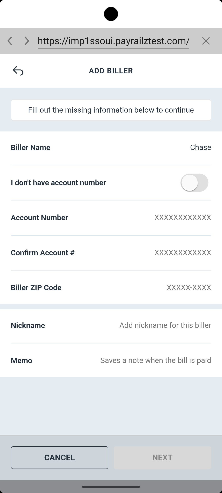

# Bill Pay — Add Biller

_Summerville Mobile › Move Money › Bill Pay — Add Biller_

## Move Money: Bill Pay — Add Biller

> The in-app webview into the Bill Pay provider (payrailztest.com shown in test) — the Add Biller form collects the account number and biller ZIP that the provider needs to route the payment.

### Step-by-Step Workflow

#### Step 1: Add Biller — Identity and Routing

The provider auto-fills the Biller Name when it's a known payee (e.g., Chase). Enter the Account Number and confirm it; if the member doesn't have an account number, toggle **I don't have account number** and the form switches to the address-based routing path. Biller ZIP Code is required — the provider uses it to disambiguate regional biller networks. Nickname and Memo are optional but highly recommended: Nickname shows in the biller list, Memo travels with each payment as a reference.

### Summary

Bill Pay lives in an embedded webview to the provider, which is why the URL bar (`https://imp1ssoui.payrailztest.com/`) is visible in the header — members should recognize the handoff but not be confused by it. The two paths through the form (with vs. without an account number) are the key fork: known-biller + account number = electronic payment, address-only path = check-issued payment, which changes the timing significantly.

### Key Use Cases

* Electric company with a member account number: enter it, ZIP code, save — payments route electronically and clear in 1-2 business days.
* One-off contractor with no account number: toggle **I don't have account number**, enter mailing address, provider issues a paper check.
* Member adds a nickname "Chase Visa" to distinguish from "Chase Mortgage": nickname appears everywhere the biller is listed in the app and on the memo line.
