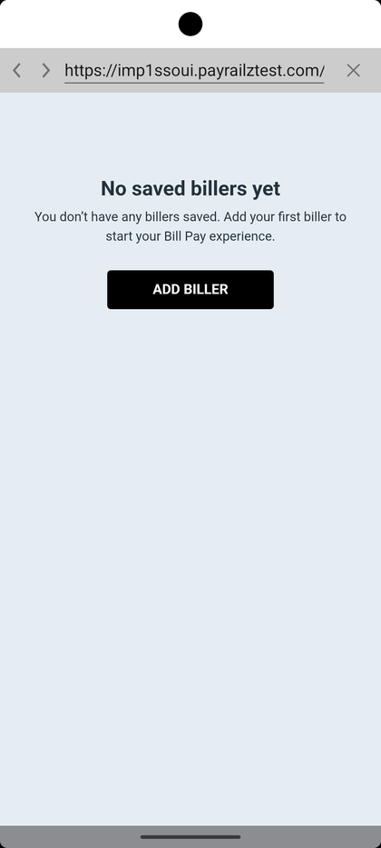
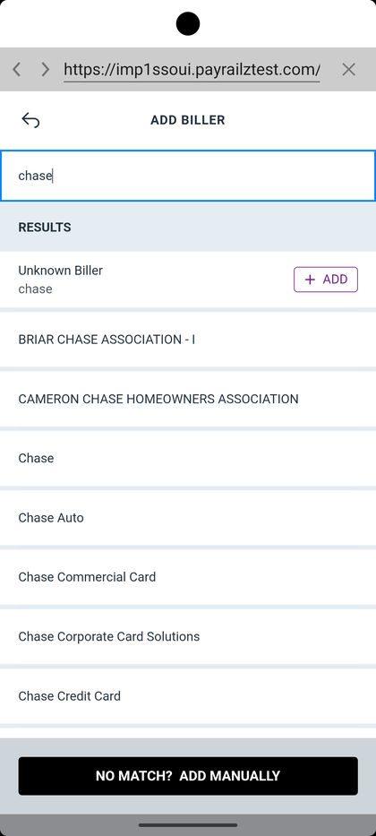

# Bill Pay — Add Biller

_Summerville Mobile › Move Money › Bill Pay — Add Biller_

## Move Money: Bill Pay — Add Biller

> The Bill Pay provider is an embedded webview (payrailztest.com). First-time users land on an empty state; searching for a biller returns a mix of known payees and a manual-add fallback. The Add Biller form then collects the account number and biller ZIP the provider needs to route the payment.

### Step-by-Step Workflow

#### Step 1: Open Bill Pay — First-Time Empty State

From Move Money Hub, tap **Pay Bills**. If you haven't added any billers yet, you'll see the empty state: *"No saved billers yet — You don't have any billers saved. Add your first biller to start your Bill Pay experience."* with a large **ADD BILLER** button. Tap it to start the add flow.

#### Step 2: Search for a Biller

The Add Biller screen opens with a search field. Type the biller's name (e.g., *chase*) and the **RESULTS** list populates with matches. Known billers appear as tappable rows with an **+ ADD** button — e.g., **Chase**, **Chase Auto**, **Chase Commercial Card**, **Chase Credit Card**. Generic match rows (**BRIAR CHASE ASSOCIATION**, **CAMERON CHASE HOMEOWNERS ASSOCIATION**) and an **Unknown Biller — chase** fallback also show. If nothing matches, a **NO MATCH? ADD MANUALLY** button at the bottom takes you to the free-entry form.

#### Step 3: Add Biller — Identity and Routing

Tapping a matched biller opens the Add Biller form with **Biller Name** pre-filled (e.g., Chase). Enter the **Account Number** and confirm it in the **Confirm Account #** field. If you don't have an account number, toggle **I don't have account number** and the form switches to the address-based routing path. **Biller ZIP Code** is required — the provider uses it to disambiguate regional biller networks. Add an optional **Nickname** (shows in the biller list) and **Memo** (travels with each payment as a reference). Tap **NEXT** to save.

### Summary

Bill Pay lives in an embedded webview to the provider (payrailztest.com shown in test), which is why the URL bar is visible. The two paths through the form (with an account number vs. without) are the key fork: known-biller + account number = electronic payment, address-only path = check-issued payment, which changes the timing significantly. The search step is important — picking a matched biller (e.g., "Chase Credit Card") gets you the fastest electronic routing; the "Unknown Biller" fallback and "Add Manually" always work but may route as a check.

### Key Use Cases

* First-time Bill Pay user: empty state → ADD BILLER → search → pick → add account details → electronic payment ready.
* Electric company with a member account number: search for the utility, pick it, enter account number + ZIP, save — clears in 1–2 business days.
* One-off contractor with no account number: search returns no match → **NO MATCH? ADD MANUALLY** → enter mailing address → provider issues a paper check.
* Member adds a nickname "Chase Visa" to distinguish from "Chase Mortgage": nickname appears everywhere the biller is listed and on the memo line.
