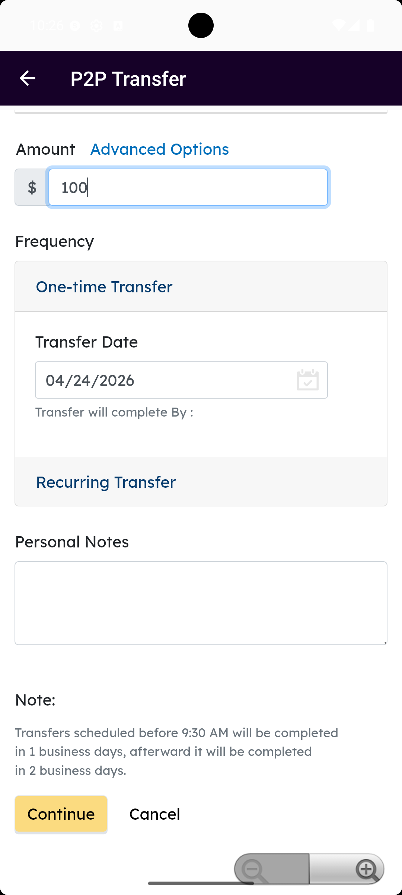

# External & P2P Transfer

_Summerville Mobile › Move Money › External & P2P Transfer_

## Move Money: External & P2P Transfer

> The form for all non-Summerville money movement — set direction (in or out), rail (Standard ACH or Same-Day Express), frequency, and optional recurring schedule in one screen.

### Step-by-Step Workflow

#### Step 1: External Transfers Landing

The P2P Transfer header with **External Transfers** and the active recipient chip (e.g., **Victor Creed**) confirms the right recipient context before the form. This screen is the transition from the recipient picker into the New Transfer form.

#### Step 2: New Transfer — Type, Method, From

Choose direction: **Receive Money** (external → Summerville) or **Send Money** (Summerville → external). Then pick rail — **Standard** (ACH, next-business-day cutoff) or **Same-day Express** (ACH same-day). Select the **From** account last, because the rail choice may restrict which accounts are eligible.

#### Step 3: Amount, Frequency, and Notes

Enter the amount and choose **One-time Transfer** (with a Transfer Date defaulting to the next business day) or **Recurring Transfer**. Personal Notes are optional and show up on the transfer record. The fine print reminds the member that transfers scheduled before 9:30 AM complete in 1 business day — use that as a live cutoff indicator, not a policy footnote.

### Summary

External ACH is the workhorse rail for routine movement to and from linked outside accounts — slower than FedNow but unlimited where FedNow has per-day ceilings, and it's the only rail that supports recurring schedules. The direction selector at the top matters: Receive pulls from the linked external account, Send pushes from Summerville — reversing them is the most common self-service error and it's worth confirming explicitly before tapping Continue.

### Key Use Cases

* Member sets up a monthly pull from their brokerage to Summerville: Type = Receive, Method = Standard, Frequency = Recurring Transfer.
* Member needs funds at the external bank today: Type = Send, Method = Same-day Express (if cutoff not passed) — otherwise switch to FedNow if the recipient is FedNow-enabled.
* Direction error — member meant Send but picked Receive: cancel and re-open; nothing commits until Continue on the review screen.
