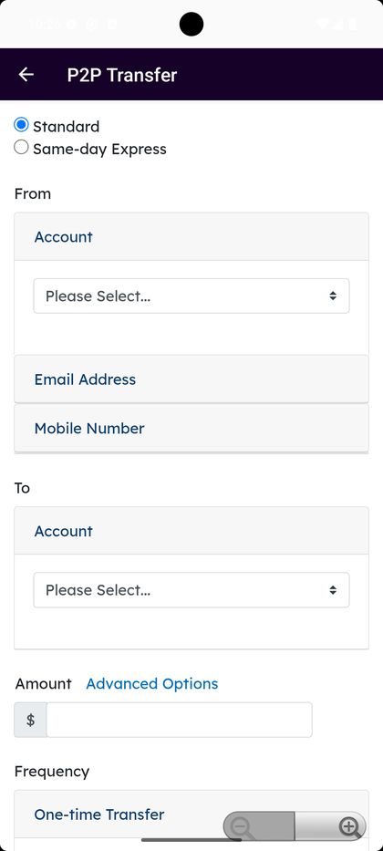
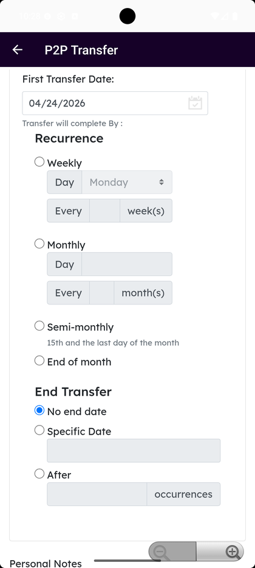
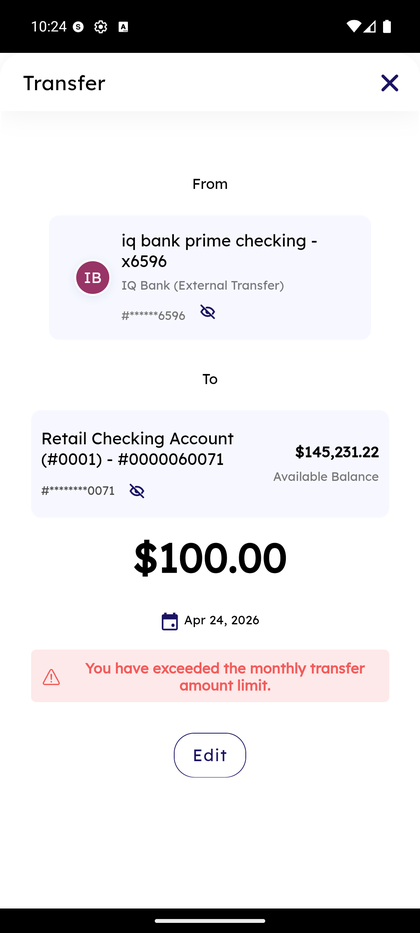

# External & P2P Transfer

_Summerville Mobile › Move Money › External & P2P Transfer_

## Move Money: External & P2P Transfer

> The form for any money movement that isn't internal or within Summerville — send to or receive from a linked external bank, pick Standard ACH or Same-Day Express, one-time or recurring with full scheduling options.

**How to get here:** Bottom navigation → **Move Money** → **P2P Transfer**

### Step-by-Step Workflow

#### Step 1: Open P2P Transfer and Pick the Rail

From Move Money Hub, tap **P2P Transfer**. The form opens with two radio options at the top: **Standard** (overnight ACH) and **Same-day Express** (same-day ACH, tighter cutoff). Pick the rail first because it affects which accounts are eligible.

#### Step 2: Select Source Account, Email/Mobile, and Destination

- **From — Account**: pick your Summerville source account from the dropdown.
- **Email Address** and **Mobile Number** tabs: use one of your on-file endpoints as the sender identity.
- **To — Account**: pick the destination (linked external recipient) from the dropdown.
- **Amount** with **Advanced Options** link for advanced scheduling.

#### Step 3: Set First Transfer Date and Recurrence

Scroll down to the scheduling section. **First Transfer Date** is a date picker with today as default. Under **Recurrence**, pick one:
- **Weekly** — Day selector (Monday–Sunday), Every N week(s).
- **Monthly** — Day of month, Every N month(s).
- **Semi-monthly** — 15th and last day of the month, or End of month.

Under **End Transfer**, pick one:
- **No end date** — runs until you cancel.
- **Specific Date** — runs until a target date.
- **After X occurrences** — runs for a fixed number of payments.

#### Step 4: Confirm With Scam Warning

On Confirm, every outbound external send shows the red-text **"Beware of scams. Remember, only send money to people you know and trust. Once these funds are sent, the transfer can't be cancelled."** warning. Review From / To / Amount / Timing, then tap **Confirm transfer(s)**.

#### Step 5: Error — Exceeded Monthly Transfer Limit

If the transfer would push you over the monthly limit for the rail, you'll see a pink error block: **"You have exceeded the monthly transfer amount limit."** with an **Edit** button to return to the form and adjust. You can either reduce the amount, wait until the next month, or request a limit increase through Help.

### Summary

External transfers are the workhorse rail for routine movement to and from linked outside accounts — slower than FedNow but unlimited where FedNow has per-day ceilings, and the only rail that supports true recurring schedules. The Standard vs Same-day Express choice at the top is the first decision; everything else flows from there. The built-in scam warning on every Confirm screen is the FI's consumer-protection speed bump for irrevocable rails — read it out loud before tapping Confirm on any unfamiliar recipient.

### Key Use Cases

* Monthly pull from a brokerage into Summerville: Standard, From external, Recurrence Monthly, End Transfer No end date.
* Need funds at external bank today: Same-day Express if before cutoff, otherwise FedNow if the recipient is FedNow-enabled.
* Over the monthly limit: the error prompts Edit — reduce the amount or wait for the next cycle.
