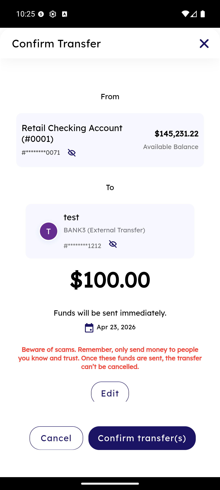

# External Transfer — Scam Warning

_Summerville Mobile › Move Money › External Transfer — Confirmation & Scam Warning_

## Move Money: External Transfer — Confirmation & Scam Warning

> Every external send ends on a Confirm screen with the **"Beware of scams"** warning — the FI's consumer-protection speed bump for irrevocable outbound rails.

### Step-by-Step Workflow

#### Step 1: Confirm Transfer With Scam Warning

The Confirm screen shows From account, To (external) recipient, the amount (e.g., **$100.00**), timing (**Funds will be sent immediately** for same-day), and a red-text warning block: *"Beware of scams. Remember, only send money to people you know and trust. Once these funds are sent, the transfer can't be cancelled."* **Edit** returns to the form, **Cancel** abandons, **Confirm transfer(s)** commits.

### Summary

The scam warning is surfaced only on external and P2P rails — it does not appear on internal own-account transfers, because those aren't the fraud vector. This is the member-facing moment where the FI satisfies its consumer-protection obligation for irrevocable payment rails (ACH debit reversal is limited, FedNow is final, Zelle is generally non-reversible). Train support to point members back to this screen when they're about to send to a new recipient they found through an unsolicited contact — reading the warning out loud is often the interrupt that stops a scam in progress.

### Key Use Cases

* Member sending a large sum to a recipient they met online: warning is read verbatim by support on the phone as the member is on this screen.
* Recurring transfer to a known recipient: warning still shows (uniformly applied), member confirms through.
* Member mid-confirmation realizes the recipient is wrong: **Edit** returns to the form without committing.
