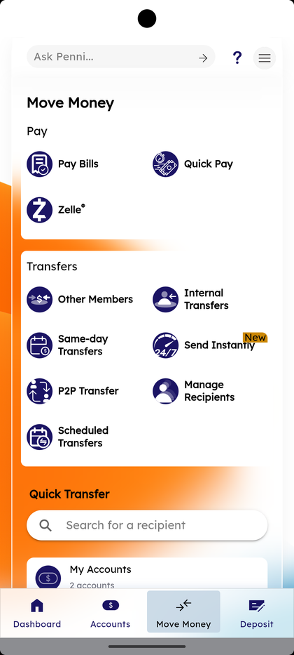
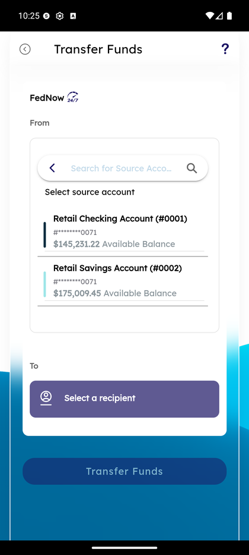
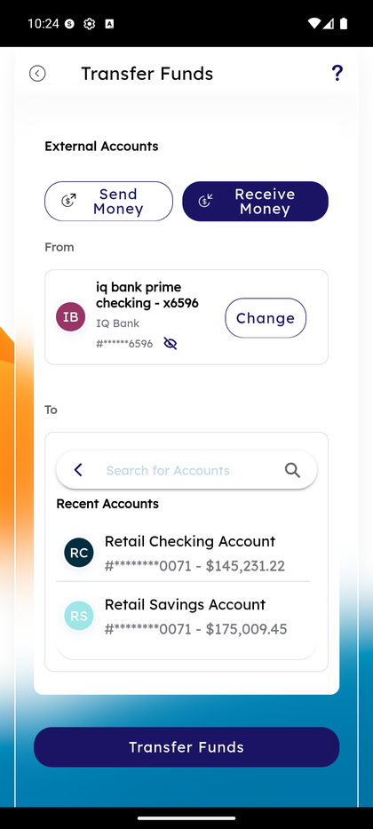
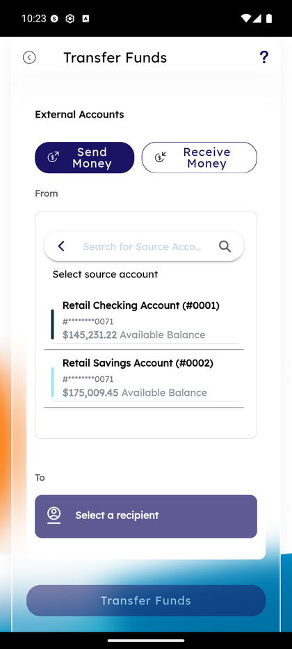
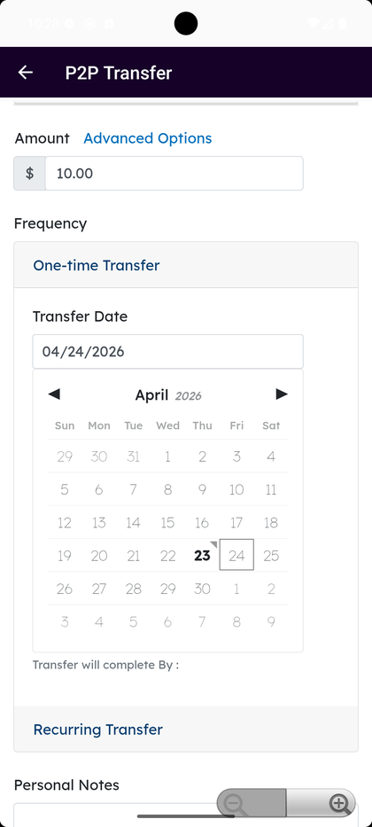
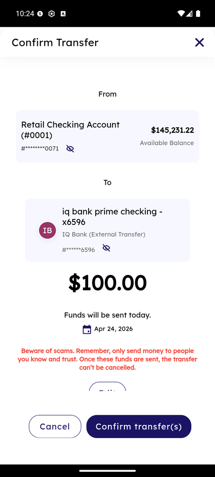
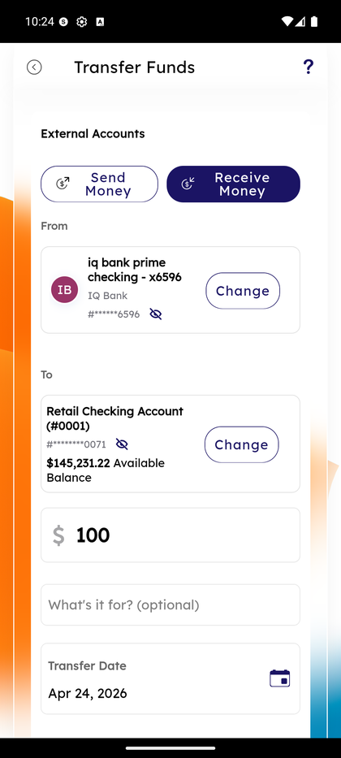

# FedNow Instant Transfer

_Summerville Mobile › Move Money › FedNow Instant Transfer_

## Move Money: FedNow Instant Transfer (Send Instantly)

> The 24/7/365 instant rails for moving money to or from an external account. Complete flow has Send Money / Receive Money modes, a FedNow-enabled recipient picker, a confirmation with scam warning, and the final success screen. Funds land in minutes including weekends and holidays.

### Step-by-Step Workflow

#### Step 1: Tap Send Instantly From Move Money

From the Move Money hub, tap **Send Instantly** (the tile with the NEW badge). The Transfer Funds screen opens with the **FedNow** badge above the From account — this is your visual confirmation you're on the instant rail.

#### Step 2: Select the Source Account

Tap the **From** dropdown (search-for-account picker). Pick **Retail Checking Account (#0001)** or **Retail Savings Account (#0002)**. Available balance is shown next to each.

#### Step 3: Pick Send Money or Receive Money

At the top of the External Accounts section, tap **Send Money** (funds leave your Summerville account) or **Receive Money** (pull funds from your external account into Summerville). Send Money is the default for outbound transfers.

#### Step 4: Select a FedNow-Enabled Recipient

The recipient list appears — each recipient shows its status as a small label: **Same Day Transfer Enabled** for ACH-only recipients, **FedNow Enabled** for recipients that can actually receive FedNow. The FedNow-Enabled badge is what tells you this send will settle instantly. Tap a FedNow-enabled recipient (e.g., *iq bank prime checking - x6596*, *test BANK3*, *testing CBW BANK*) or **New Recipient** to add one.

#### Step 5: Enter Amount and See Instant-Send Note

With source and recipient selected, enter the amount (e.g., **$100**). The notice below reads *"Funds will be sent immediately"* with *"Daily remaining FedNow limit: $99,999,899.99"* underneath. A **What's it for?** memo field and **Transfer Date** (today, locked) complete the form.

#### Step 6: Confirm Transfer With Scam Warning

Tap Transfer Funds to reach the Confirm screen. You'll see From / To / amount / date plus the red-text *"Beware of scams. Remember, only send money to people you know and trust. Once these funds are sent, the transfer can't be cancelled."* — FedNow is final once it leaves. Read carefully before tapping **Confirm transfer(s)**.

#### Step 7: Receive Money — Pull From External

Alternative: if you tapped **Receive Money** in Step 3, the form flips — **From** shows your linked external (e.g., *iq bank prime checking*), **To** shows your Summerville account. Amount, date, and confirm follow the same pattern. Receive Money is useful to pull funds from a personal external account into Summerville when you need the money on the Summerville side immediately.

### Summary

FedNow is the biggest member-satisfaction win over ACH — Sunday-night rent, after-hours emergency transfers, weekend payroll. Every rail in the app uses the same Transfer Funds shell, but FedNow is distinguished by the FedNow badge on the From card and the per-recipient FedNow Enabled label. The daily limit is effectively unlimited for most members, but the limit number is shown inline so you never hit it by surprise. Because FedNow is irreversible, the Confirm step's scam warning is uniformly applied — read it every time before you tap Confirm.

### Key Use Cases

* Sunday-night rent due to a landlord's IQ Bank account: Send Money → FedNow-enabled recipient → send → lands before Monday-morning late fees.
* Pulling paycheck from a FedNow-enabled employer external: Receive Money → external → Summerville → instant credit.
* Recipient doesn't support FedNow: their label reads **Same Day Transfer Enabled** (ACH) without FedNow — use External & P2P Transfer instead for ACH rails.
* Unsure if a recipient is FedNow-enabled: pick them in Step 4 — the label tells you before you commit.
