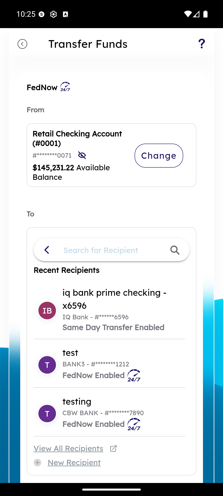
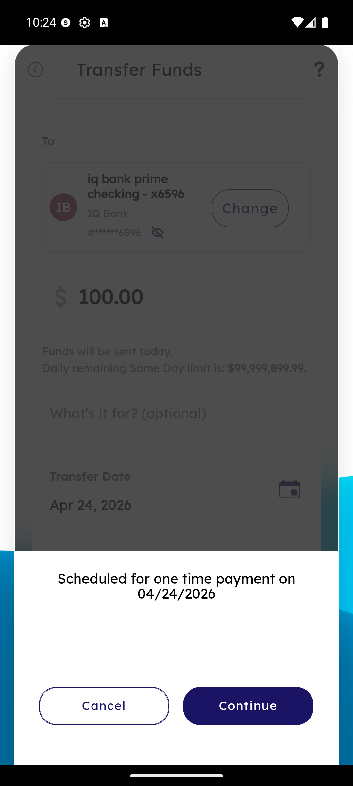

# FedNow Instant Transfer

_Summerville Mobile › Move Money › FedNow Instant Transfer_

## Move Money: FedNow Instant Transfer

> 24/7/365 instant rails for moving money to an external account — the single biggest member-satisfaction win over ACH, and the one they'll expect to work on a Sunday night.

### Step-by-Step Workflow

#### Step 1: Select FedNow-Enabled Recipient

The FedNow badge above the From account makes it clear this is the instant rail. Recent Recipients are labelled with their status — **Same Day Transfer Enabled** for ACH same-day recipients, **FedNow Enabled** for the ones that can actually receive the instant payment. Tap a FedNow-enabled recipient to continue, or **New Recipient** to add one.

#### Step 2: Review Scheduled One-Time Payment

Before the send, the app stacks a confirmation sheet over the transfer details: amount, date, and the "Scheduled for one time payment on" summary. Same-day limit is stated inline so the member sees the rail's ceiling before they confirm. Tap **Continue** to send; tap **Cancel** to return to the form.

### Summary

FedNow is surfaced as a peer rail inside the same Transfer Funds shell used for internal transfers, so the member doesn't learn a second flow. The instant-rail distinction shows up in two places that matter: the FedNow badge on the From card, and the per-recipient status labels in the picker that say which rail each recipient supports. Scheduling defaults to one-time today; recurring FedNow is not available (by design — instant recurring is an anti-pattern for consumer apps).

### Key Use Cases

* Sunday-night rent due to a landlord's IQ Bank account: select FedNow-enabled recipient, send, money lands before the Monday morning late fee.
* Member tries to send FedNow to an ACH-only recipient: their status label reads **Same Day Transfer Enabled** without the FedNow badge, flagging that FedNow isn't a choice here.
* Large transfer approaches the per-day FedNow ceiling: the "Daily remaining Same Day limit" line under the amount field shows how much headroom is left.
