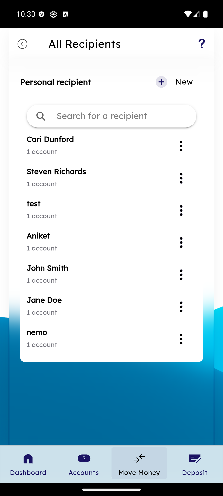
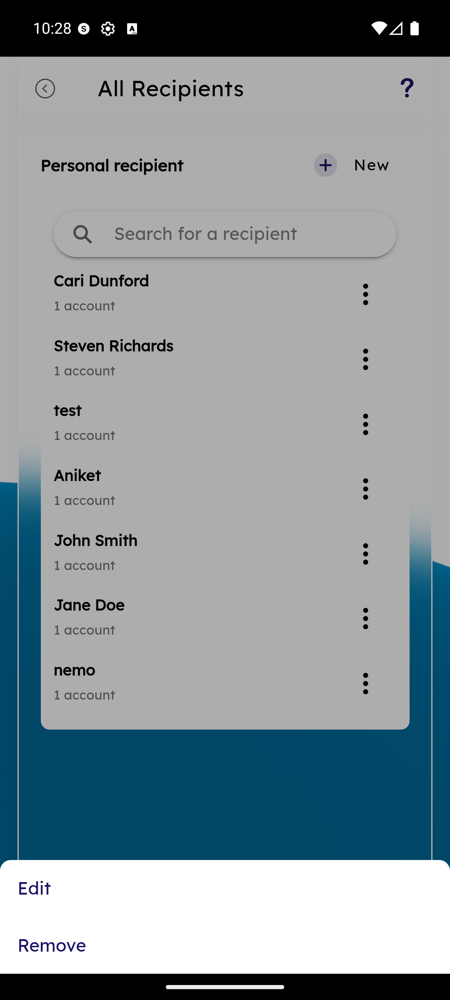
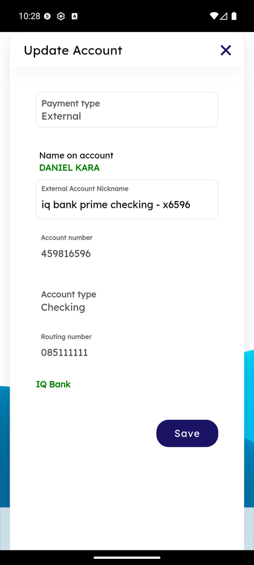

# Manage Recipients

_Summerville Mobile › Move Money › Manage Recipients_

## Move Money: Manage Recipients

> The system-of-record for every external person and account the member sends to repeatedly — grouped by Individual vs. Business, with per-recipient edit/remove from a long-press sheet.

### Step-by-Step Workflow

#### Step 1: All Recipients List

The All Recipients screen groups entries by type — **Personal recipient** section at the top with a **+ New** button, followed by a search bar and the full list (*Cari Dunford — 1 account, Steven Richards — 1 account, test — 1 account, Aniket, John Smith, Jane Doe, nemo*). Tap a row to view its accounts or long-press for quick actions.

#### Step 2: Long-Press for Edit / Remove

Long-pressing a recipient row dims the list and opens a bottom action sheet with **Edit** and **Remove**. Edit opens the recipient detail; Remove confirms deletion and immediately removes the recipient from the Transfer Funds picker.

#### Step 3: Update Account — External Recipient Detail

Inside a recipient, tap an account to open the **Update Account** sheet. Editable fields: **Payment type** (External / Internal), **External Account Nickname**, and the routing/account-number path. **Name on account** and institution (e.g., *DANIEL KARA — IQ Bank*) are read-only after first save — keyed off the aggregator's verification response.

### Summary

Manage Recipients is the only place in the app where external account details can be edited without creating a new recipient — the nickname update is the most-used edit and the only one that doesn't trigger aggregator re-verification. Long-press-for-actions is a mobile convention that matches iOS/Android patterns; the same Edit/Remove pair is on every recipient row.

### Key Use Cases

* Member renames "My Chase Checking" → "Joint Savings" for clarity: long-press → Edit → Nickname → Save.
* Cleaning a stale recipient: long-press → Remove → confirmed → gone from Transfer Funds picker immediately.
* Member realizes a saved routing number is wrong: long-press → Edit → update routing → Save → aggregator re-verifies.
