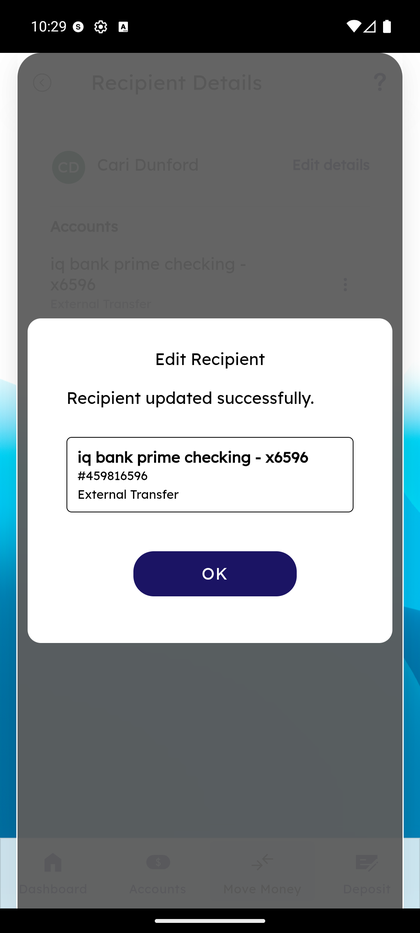
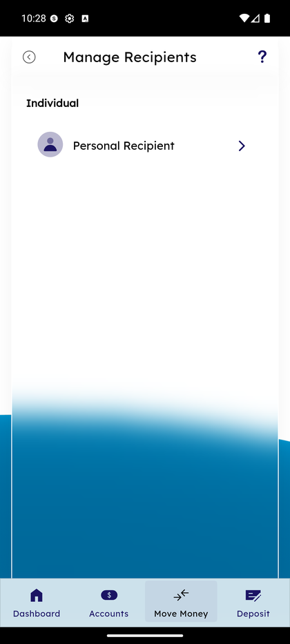
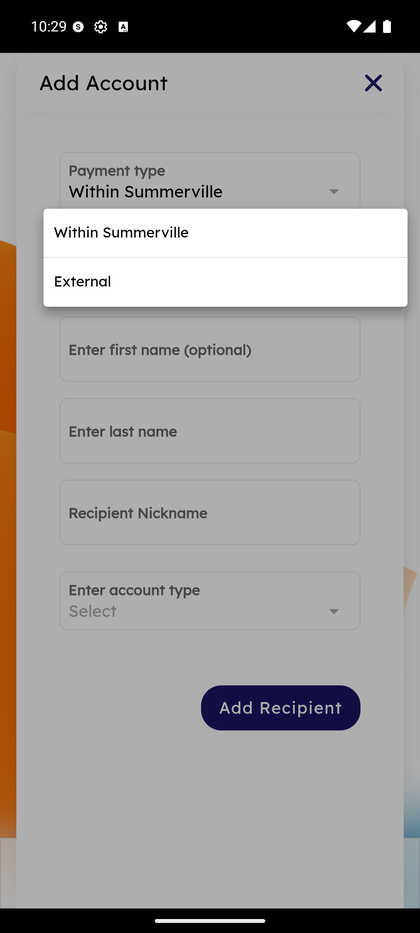

# Manage Recipients

_Summerville Mobile › Move Money › Manage Recipients_

## Move Money: Manage Recipients

> The authoritative list of every recipient you send to. Browse all recipients, search by name, open details to see linked accounts, edit details (name + nickname), add another account to a recipient, or remove the recipient entirely.

### Step-by-Step Workflow

#### Step 1: Open Manage Recipients From Move Money

Tap **Move Money** in the bottom nav, then **Manage Recipients**. The **All Recipients** screen loads.

#### Step 2: Browse, Search, or Add New

The **All Recipients** screen groups entries by type — **Personal recipient** at the top with a **+ New** button. A search bar lets you filter by name. Your saved recipients are listed with their count of linked accounts (e.g., *Cari Dunford — 1 account*, *Steven Richards — 1 account*, *test — 1 account*). Each row has a **⋮** three-dot menu at the right.

#### Step 3: Tap a Recipient to Open Details

Tap a recipient row (e.g., **Cari Dunford**). **Recipient Details** opens — a card with the recipient's name, an **Edit details** link, and an **Accounts** section listing every account you've added for them (e.g., *iq bank prime checking - x6596 — External Transfer*). **+ Add Account** at the bottom lets you link a second account (personal + business, checking + savings) to the same recipient.

#### Step 4: Long-Press for Quick Edit / Remove

From the All Recipients list, long-press a row to open the bottom action sheet with **Edit** and **Remove**. Edit opens the recipient detail; Remove confirms deletion and removes the recipient from the Transfer Funds picker immediately.

#### Step 5: Edit Recipient — Success Dialog

After making changes via **Edit details** (name, nickname) and saving, a success dialog appears: *"Edit Recipient — Recipient updated successfully."* with the updated account card below (e.g., *iq bank prime checking - x6596, #459816596, External Transfer*). Tap **OK** to dismiss.

### Summary

Manage Recipients is the authority for every external person and account you send to. The list + search + long-press pattern matches iOS/Android conventions, so members find the action they need quickly. The critical thing to understand is the recipient / account split: a single recipient (e.g., your landlord) can have multiple accounts under them (personal + business account), and edits to the recipient's name apply to all their accounts; edits to a specific account (nickname, routing) happen inside that account's Update Account sheet. Removing a recipient removes all their accounts at once — for single-account cleanup, open Recipient Details and remove the specific account instead.

### Key Use Cases

* Rename a recipient: All Recipients → long-press → Edit → update name → save → success dialog.
* Add a second account to an existing recipient: tap the row → Recipient Details → **+ Add Account**.
* Clean out a stale recipient no longer in use: long-press → Remove.
* Quick lookup when setting up a transfer: search by name at the top of the list.
