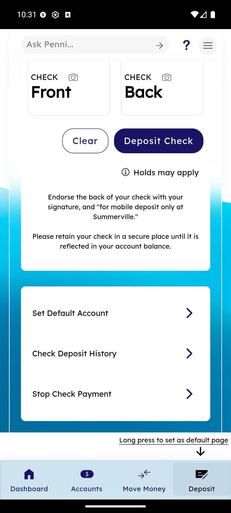
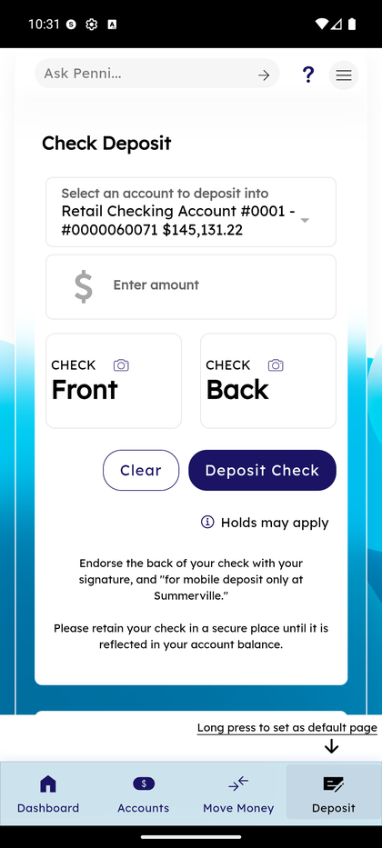
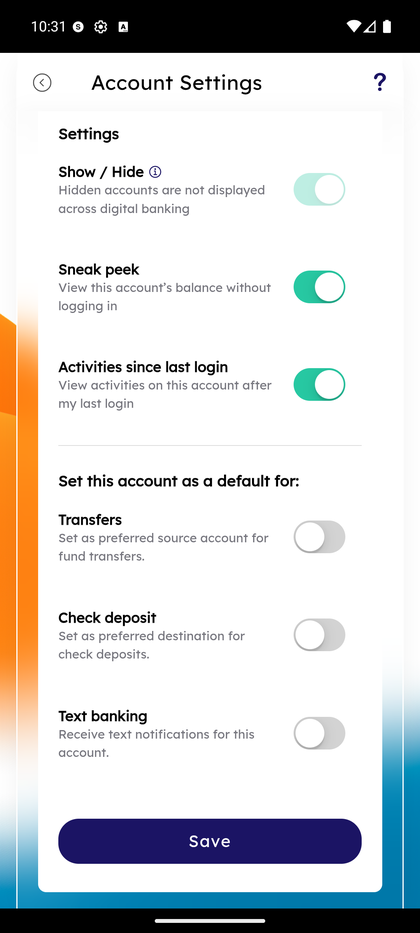
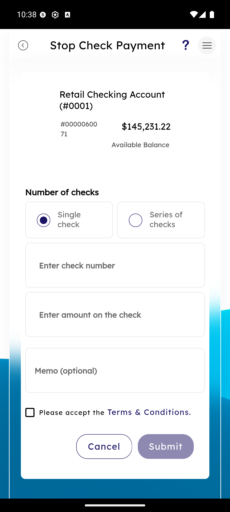

# Mobile Check Deposit (RDC)

_Summerville Mobile › Move Money › Mobile Check Deposit_

## Move Money: Mobile Check Deposit — Remote Deposit Capture

> The Deposit tab is the full RDC surface — pick the destination account, enter the amount, capture the front and back of the check, endorse correctly, and submit. Three persistent quick actions below the capture panel handle the related "member is thinking about checks" cases: **Set Default Account** (pick your preferred deposit destination), **Check Deposit History** (audit of past RDC submissions), and **Stop Check Payment** (stop a check you wrote).

**How to get here:** Bottom navigation → **Deposit**

### Step-by-Step Workflow

#### Step 1: Open the Deposit Tab

From the bottom navigation, tap **Deposit**. The Check Deposit form loads with the destination account, amount field, capture cards, and the three quick actions below.

#### Step 2: Pick Destination Account and Enter Amount

At the top, the **Select an account to deposit into** dropdown defaults to your primary checking (e.g., *Retail Checking Account #0001 - #0000060071 $145,131.22*). Change if needed. The **Enter amount** field takes the exact dollar amount of the check you're depositing.

#### Step 3: Capture Front and Back

Two capture cards appear side-by-side — **CHECK Front** and **CHECK Back** — each with a camera icon that launches the native camera with auto-capture framing. Align the check inside the frame and hold still; the camera auto-detects edges and captures. **Clear** wipes both captures so you can retake; **Deposit Check** submits.

#### Step 4: Endorse and Retain

The on-screen instruction reads: *"Endorse the back of your check with your signature, and 'for mobile deposit only at Summerville.'"* The restrictive endorsement is the fraud control that prevents double-deposit. *"Please retain your check in a secure place until it is reflected in your account balance"* is the reminder to hold the paper check through any hold window. The **Holds may apply** notice at the top is the member-facing surface of the FI's Reg CC funds-availability rules.

#### Step 5: Quick Action — Set Default Account

Below the capture panel, tap **Set Default Account**. This opens the Account Settings screen for that account with the **Set this account as a default for** toggles visible. Turn on **Check deposit — Set as preferred destination for check deposits**, tap **Save**, and the Deposit tab will pre-select this account on every future visit. The same section also includes **Transfers** (pre-select as transfer source) and **Text banking** (route SMS notifications to this account), so you can set all three defaults in one screen.

#### Step 6: Quick Action — Check Deposit History

Tap **Check Deposit History** to see the audit list of past RDC submissions. Each entry shows the submission date, amount, destination account, and status — **Submitted**, **In Review**, **Posted**, or **Held** (with the specific hold reason). This is the authoritative record when you need to answer "did my deposit clear" or "why is there a hold."

*Note: the History list screen isn't in this capture set. Capture it on next use and this step will be updated with the real screenshot.*

#### Step 7: Quick Action — Stop Check Payment

Tap **Stop Check Payment** to leave the RDC flow and enter a stop-payment order for a check you wrote. This is a separate feature co-located here because members thinking about checks are the ones most likely to realize they need to stop one. See the [Stop Check Payment](stop-check-payment.md) doc for the full single-check vs series-of-checks flow.

### Summary

RDC is the highest-ROI self-service feature for a community FI — it eliminates a branch trip for every paper check — and the friction in the experience is the fraud-control layer, not the tech. The restrictive-endorsement instruction, the retain-the-check reminder, and the funds-availability hold notice are all calibrated to match Reg CC and the FI's risk posture. The three quick-action rows (Set Default, History, Stop Check Payment) make this the single most-visited screen in the app for check-related questions, which is why the **Long press to set as default page** hint at the bottom lets power users pin Deposit as their landing screen.

### Key Use Cases

* Business owner depositing a vendor rebate check on a Saturday: capture, endorse, submit, funds available per posted hold policy.
* Member asks why their deposit hasn't cleared: **Check Deposit History** shows per-item status (Submitted / In Review / Posted / Held) and the specific hold reason.
* Member always deposits to savings rather than the default checking: **Set Default Account** → toggle Check deposit on for Retail Savings, every future RDC pre-selects it.
* Member realizes they wrote a check to the wrong payee: **Stop Check Payment** from the Deposit tab routes into the stop-payment flow without navigating away.
