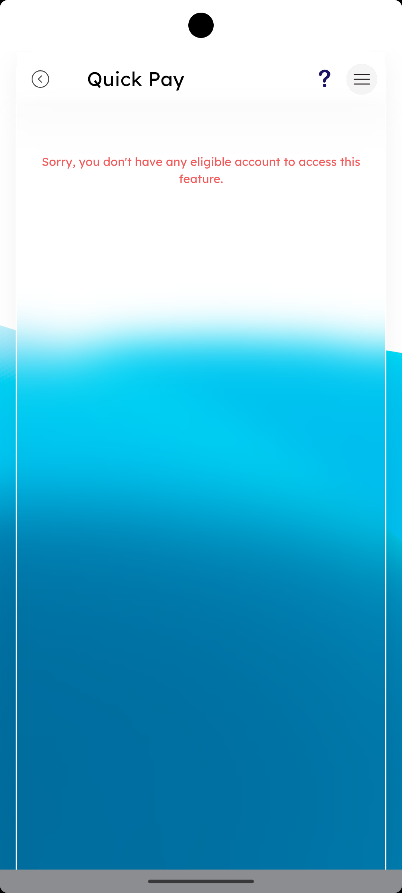

# Quick Pay SSO

_Summerville Mobile › Move Money › Quick Pay SSO_

## Move Money: Quick Pay (SSO)

> Quick Pay is a single-sign-on handoff into the credit union's external Quick Pay provider for one-off payments — the landing screen also doubles as the eligibility gate when the member's accounts don't qualify.

### Step-by-Step Workflow

#### Step 1: Quick Pay Eligibility Gate

When the member isn't eligible — typical reasons are no qualifying checking account or an enrollment restriction — the screen shows a red notice: *"Sorry, you don't have any eligible account to access this feature."* This is the gate, not an error; the back chevron in the header returns to Move Money.

### Summary

Quick Pay is an SSO-only feature, so the eligibility gate lives on the landing screen before any external handoff happens — this prevents a confusing redirect into the provider and a failure message on their domain. When the member sees the red notice, the operational fix is on the core side (verify account eligibility) or the enrollment side (confirm they're opted into Quick Pay); neither is a self-service path inside the mobile app.

### Key Use Cases

* New member sees the eligibility notice: support confirms their primary checking is flagged eligible in core, gate clears on next session.
* Eligible member taps Quick Pay: screen briefly shows and then SSO-hands off to the provider — no manual login.
* Member reports the gate unexpectedly: check for a recent account status change (frozen, closed, or converted) that removed eligibility.
