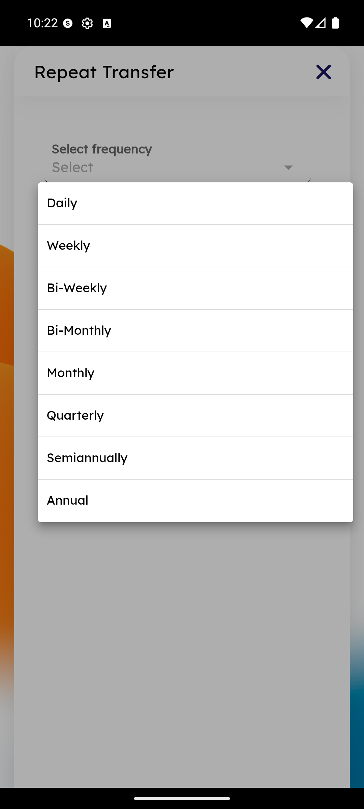

# Scheduled & Recurring Transfers

_Summerville Mobile › Move Money › Scheduled & Recurring Transfers_

## Move Money: Scheduled & Recurring Transfers

> Recurring transfers are the set-once, forget-forever workflow — 8 frequencies from Daily through Annual, with a confirm step that shows the full schedule before commit and a cancel-anytime sheet for reversal.

### Step-by-Step Workflow

#### Step 1: Choose Frequency

From the transfer form, tap **Repeat Transfer** to open the frequency sheet. Options: **Daily, Weekly, Bi-Weekly, Bi-Monthly, Monthly, Quarterly, Semiannually, Annual**. The sheet is a single-select list — pick one, the sheet closes, and the selected frequency becomes part of the transfer record.

#### Step 2: Confirm Scheduled Transfer

The Confirm screen previews the full schedule in one frame: **From / To accounts**, **amount**, start date, and the human-readable cadence line (*"Scheduled: Weekly, until I cancel"* with *"Transfers will be made every week on Thursday"* below). **Edit** bounces back to the form, **Cancel** discards, **Confirm transfer(s)** commits the schedule to the server.

#### Step 3: Cancel a Scheduled Transfer

From the **Scheduled Transfers** list, tap **Delete** on any row; the **Confirm** dialog asks *"Are you sure you want to cancel this scheduled transfer?"* and requires an explicit **OK** to cancel. **Cancel** in the dialog keeps the schedule active. Canceling one instance of a recurring transfer cancels the entire series — per-occurrence skip isn't supported from this sheet.

### Summary

Recurring transfers serve the two most common repeat patterns — payroll-day savings splits and fixed-amount household transfers — with a frequency list that covers everything from daily overdraft sweeps to annual tax top-ups. The "until I cancel" default (no end date) matches how most recurring needs actually run; members who want a fixed end date can edit before confirming. The explicit confirm-to-cancel guardrail prevents fat-finger cancellation of a mission-critical auto-transfer, which is the most reported regret-action for this feature.

### Key Use Cases

* Weekly paycheck savings split: Weekly frequency, Retail Checking → Retail Savings, fixed amount, starts next Thursday.
* Monthly rent auto-transfer to an external recipient: Monthly frequency, Standard ACH rail, same calendar day each month.
* Member wants to pause during a tight month: current behaviour is cancel-and-re-create; there's no built-in pause — document this as a gap when members ask.
