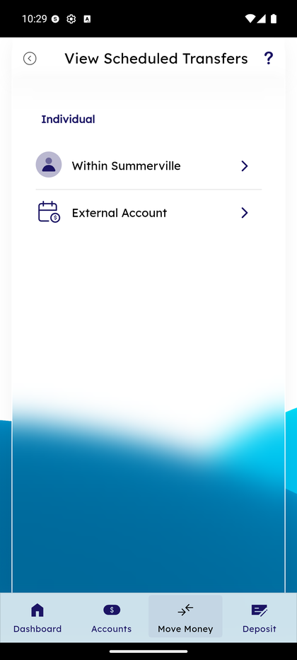
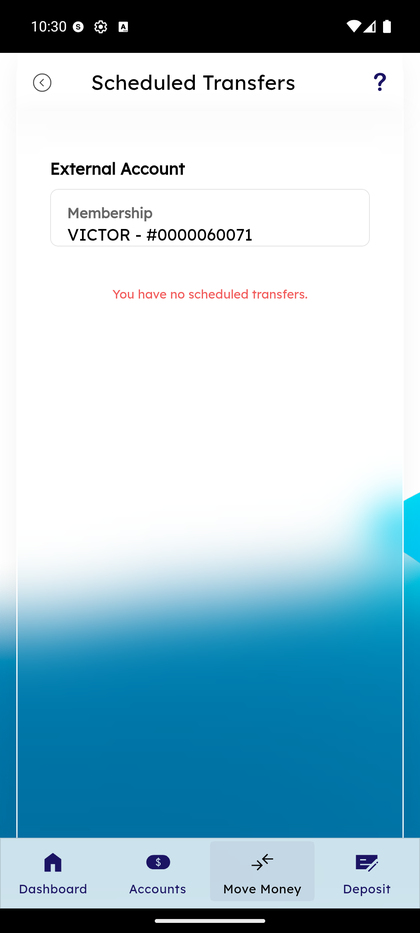

# Scheduled & Recurring Transfers

_Summerville Mobile › Move Money › Scheduled & Recurring Transfers_

## Move Money: Scheduled & Recurring Transfers

> Two related surfaces. The **Repeat Transfer** sheet inside any transfer form is where you set up a recurring schedule (8 frequencies, optional end date). The **View Scheduled Transfers** screen is where you review, edit, or cancel every transfer you've scheduled — split by Within Summerville vs External Account.

### Step-by-Step Workflow

#### Step 1: Open the Repeat Transfer Sheet

Inside any Transfer Funds form, tick the **Repeat transfer** checkbox to open the Repeat Transfer sheet. You'll see two empty dropdowns — **Select frequency** and **End on** — with **Cancel** and **Save** at the bottom.

#### Step 2: Pick Frequency

Tap **Select frequency**. The list expands to show **Daily, Weekly, Bi-Weekly, Bi-Monthly, Monthly, Quarterly, Semiannually, Annual** — 8 options covering every realistic cadence from daily overdraft sweeps to annual tax top-ups.

#### Step 3: Pick End Condition

Tap **End on**. Two options: **End Date** (you pick a calendar stop date) or **Until I Cancel** (runs indefinitely — the most common choice for real recurring needs like weekly savings splits).

#### Step 4: Save the Schedule

Both dropdowns filled (e.g., *Weekly*, *Until I Cancel*), tap **Save** to apply the schedule back to the transfer form, or **Cancel** to discard.

#### Step 5: Confirm the Recurring Transfer

After tapping Transfer Funds on the main form, the Confirm screen shows the full schedule: **From / To accounts**, **amount**, **Scheduled: Weekly, until I cancel**, and *"Transfers will be made every week on Thursday"*. **Edit** bounces back, **Cancel** discards, **Confirm transfer(s)** commits.

#### Step 6: Open View Scheduled Transfers

From Move Money or the Dashboard's Quick Transfer section, tap **View Scheduled Transfers**. The landing screen groups your schedules by type: **Individual** section with two rows — **Within Summerville** and **External Account**. Tap either to see the schedules of that type.

#### Step 7: View the Scheduled Transfers List

Within Summerville shows any active within-credit-union schedules: From, To, frequency (*One Time* / *Weekly* / etc.), Next transaction date, amount, and **Delete** / **Edit** buttons per row. External Account shows external-rail schedules in the same format. If none exist, you'll see *"You have no scheduled transfers"* below the membership header.

#### Step 8: Empty State — No Scheduled Transfers

If you haven't scheduled anything yet (or cancelled everything), the list shows *"You have no scheduled transfers"* with the selected membership at the top. No Delete/Edit controls — just the empty state.

#### Step 9: Cancel a Scheduled Transfer

Tap **Delete** on any row. A **Confirm** dialog asks *"Are you sure you want to cancel this scheduled transfer?"* with **Cancel** and **OK**. Tap **OK** to cancel the series; tap **Cancel** in the dialog to keep it active. Cancelling one instance of a recurring transfer cancels the whole series.

### Summary

Recurring transfers serve two common patterns: payroll-day splits (paycheck → savings) and fixed-amount household transfers (rent, subscriptions). The 8-frequency list covers everything from daily sweeps to annual tax top-ups. **Until I Cancel** is the realistic default — most members don't know a future end date. The View Scheduled Transfers screen splits Within Summerville from External Account because they're different rails with different cancellation windows (within-core cancellations are instant; external cancellations may be blocked if the ACH file has already been originated). Delete gives you a fast kill-switch but the confirm dialog is the guardrail against fat-finger regret.

### Key Use Cases

* Weekly paycheck savings split: Weekly / Until I Cancel → Retail Checking → Retail Savings → fixed amount.
* Monthly external rent transfer with known lease end: Monthly / End Date = lease end → runs until that date, then stops automatically.
* Review all active schedules: View Scheduled Transfers → pick type → list with Delete/Edit per row.
* Pause a transfer for a month: no built-in pause — cancel and recreate when ready.
