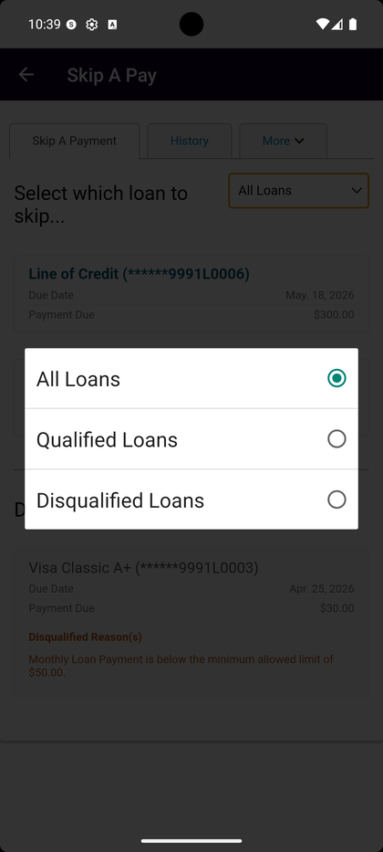

# Skip A Pay

_Summerville Mobile › Move Money › Skip A Pay_

## Move Money: Skip A Pay

> Push a loan payment out by one cycle without calling the credit union. Pick the loan, accept the fee and terms, and the due date moves. Limited to twice in any 12-month period; a processing fee applies. The loan list at the top includes a filter (All / Qualified / Disqualified) and a separate Disqualified Loans section that explains why specific loans aren't skippable.

**How to get here:** Side Menu (☰) → **Skip A Pay**

### Step-by-Step Workflow

#### Step 1: Open the Side Menu

Tap the **☰** hamburger icon at the top-right of any screen.

#### Step 2: Scroll Down and Tap Skip A Pay

Scroll the Side Menu past the main navigation rows. Tap **Skip A Pay — Skip A Pay**.

#### Step 3: Review Eligible Loans

The **Skip A Pay** screen opens with three tabs at the top: **Skip A Payment** (active), **History**, **More**. Below the tabs, *"Select which loan to skip..."* with a loan-filter dropdown defaulting to **All Loans**. Eligible loans are listed: *Line of Credit (******9991L0006) — Due May 18, 2026 — Payment Due $300.00*; *Used Automobile (******9991L0004) — Due Apr 25, 2026 — Payment Due $450.00*. A **Disqualified Loans** section below lists loans that can't be skipped with the disqualification reason.

#### Step 4: Filter by Loan Type

Tap the loan-filter dropdown to narrow the list. Three options: **All Loans** (default), **Qualified Loans** (only those eligible for skip), **Disqualified Loans** (only those not eligible — useful for confirming why a loan is showing up as disqualified).

#### Step 5: Review the New Due Date and Fee

Pick a loan to advance. The confirm screen shows the current and new due dates side by side (e.g., **Current Due Date: May 18, 2026** → **Advanced Due Date: June 18, 2026**) plus the **Transaction Fee** ($35.00 in the capture). A note reminds you of the *"two times within a 12 month period"* limit.

#### Step 6: Pick Fee Payment Method and Accept Terms

Choose how to pay the $35 fee: **Credit Union Account** (with dropdown), **Charge my Credit Card**, or **Add to Loan Balance**. Read the **Terms & Conditions** block and tick *"I agree to the terms and fees as stated above"* to enable **Finish**. Tap **Finish** to submit.

#### Step 7: Success Confirmation

On submit, a success screen appears with a large blue checkmark and the message *"Your request for a skip payment has been processed."* in green. Tap **Proceed** to return to the Skip A Pay home.

#### Step 8: View Skip History

Back on Skip A Pay, tap the **History** tab. Each request shows **Pending** or **Completed** status with the loan reference and *"Requested: date at time"*. The **More ▾** dropdown next to History includes **Notification History** for the related skip notifications.

### Summary

Skip A Pay handles what used to be a phone call to the loan officer — pick the loan, accept the fee, the due date moves. The loan-filter dropdown gives you a fast way to see only the loans you can actually skip (Qualified Loans) when you're trying to move multiple payments. The two-per-year limit is enforced server-side; loans that have hit the cap appear under Disqualified with the reason stated. The fee can come from checking, a credit card, or the loan balance itself. The History tab is your receipt for any past skip.

### Key Use Cases

* Unexpected expense eats cash you'd earmarked for the car loan: Skip A Pay → All Loans → pick the auto loan → pay the $35 fee from checking → due date moves a month.
* Already skipped twice this year: filter by **Disqualified Loans** to see what's blocked and why.
* Quick scan of just-skippable loans: filter by **Qualified Loans** to skip the disqualified noise.
* Checking on a prior skip: History tab shows Pending / Completed per request with timestamps.
