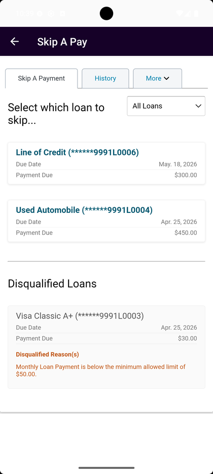
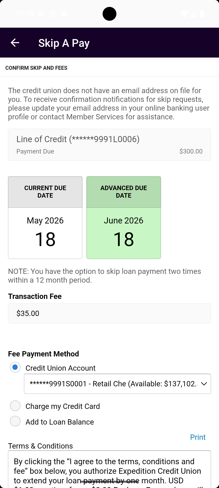
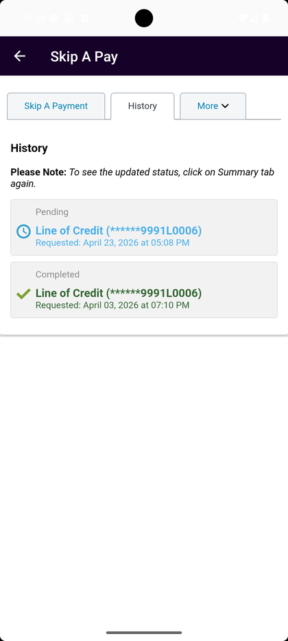
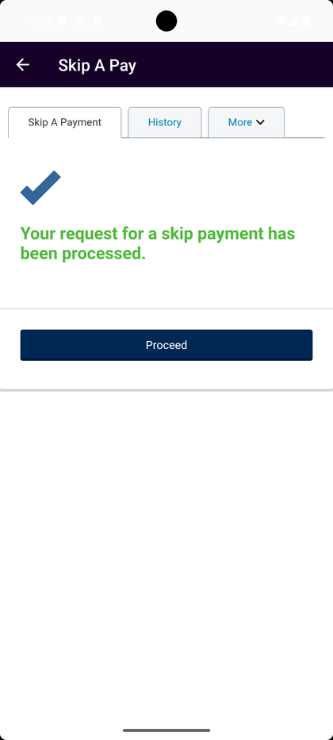
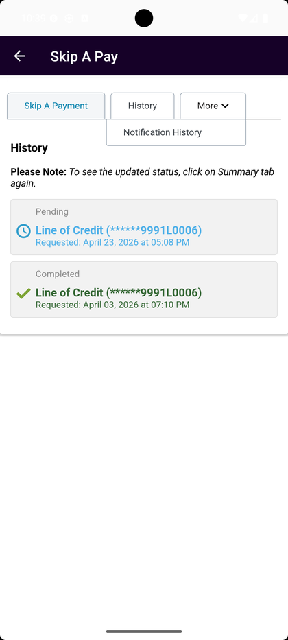

# Skip A Pay

_Summerville Mobile › Move Money › Skip A Pay_

## Move Money: Skip A Pay

> Push a loan payment out by one cycle without calling the credit union. Pick the loan, accept the fee and terms, and the due date moves. Limited to twice in any 12-month period; a processing fee applies.

**How to get here:** Side Menu (☰) → **Skip A Pay**

### Step-by-Step Workflow

#### Step 1: Open Skip A Pay and Choose the Loan

From the Side Menu, tap **Skip A Pay**. The screen shows three tabs at the top: **Skip A Payment** (active), **History**, **More**. Below the tabs, a loan selector shows your eligible loans: *Line of Credit (******9991L0006) — Due May 18, 2026 — Payment Due $300.00*; *Used Automobile (******9991L0004) — Due Apr 25, 2026 — Payment Due $450.00*. A **Disqualified Loans** section below lists loans that can't be skipped with the reason (e.g., *Monthly Loan Payment is below the minimum allowed limit of $50.00*). Tap the loan you want to skip.

#### Step 2: Review the New Due Date and Fee

The confirm screen shows the current and new due dates side by side — e.g., **Current Due Date: May 18, 2026** moving to **Advanced Due Date: June 18, 2026** — plus the **Transaction Fee** ($35.00 in the capture). A note reminds you that *"You have the option to skip loan payment two times within a 12 month period."* Scroll down to continue.

#### Step 3: Pick Fee Payment Method and Accept Terms

Choose how to pay the $35 fee:
- **Credit Union Account** — default, picks your primary checking.
- **Charge my Credit Card** — charges to a linked credit card.
- **Add to Loan Balance** — rolls the fee into the loan principal.

Read the full **Terms & Conditions** block — this is the ESIGN-required disclosure for the payment deferral — then tick **"I agree to the terms and fees as stated above"** to enable **Finish**. Tap **Finish** to submit.

#### Step 4: Success Confirmation

On submit, a success screen appears with a large blue checkmark and the message *"Your request for a skip payment has been processed."* in green. Tap **Proceed** to return to the Skip A Pay home.

#### Step 5: View Skip History

Back on the Skip A Pay screen, tap the **History** tab. Each skip request is listed with its status (**Pending** or **Completed**) and the request timestamp (e.g., *"Requested: April 23, 2026 at 05:08 PM"*). The **More ▾** dropdown next to History includes **Notification History** for the related skip notifications.

### Summary

Skip A Pay is a one-screen-per-step flow that handles what used to be a phone call to the loan officer — you pick the loan, accept the fee, and the due date moves. The two-per-year limit is enforced by the system; members who hit the cap will see those loans under Disqualified until the rolling 12-month window resets. The fee can go anywhere from your checking to the loan balance itself, whichever is least painful that month. The History tab is your receipt for any past skip; support will always reference it when a member calls asking "did my skip go through."

### Key Use Cases

* Unexpected vet bill eats the cash you had earmarked for the car loan: Skip A Pay → pick the auto loan → pay the $35 fee from checking → due date moves a month.
* Already skipped twice this year: your loans show up under Disqualified with "twice in a rolling 12 months" as the reason.
* Checking on a prior skip: History tab shows Pending / Completed per request with timestamps.
