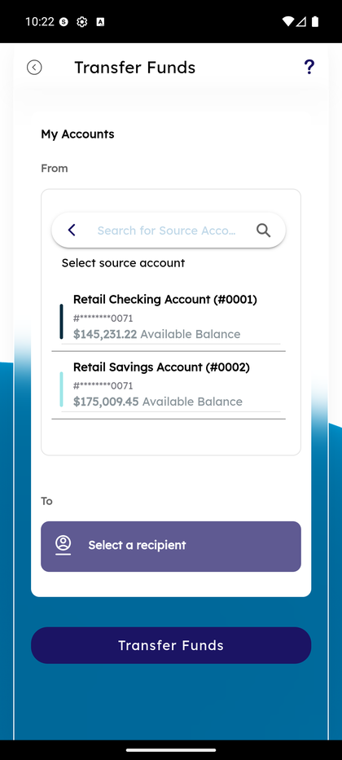
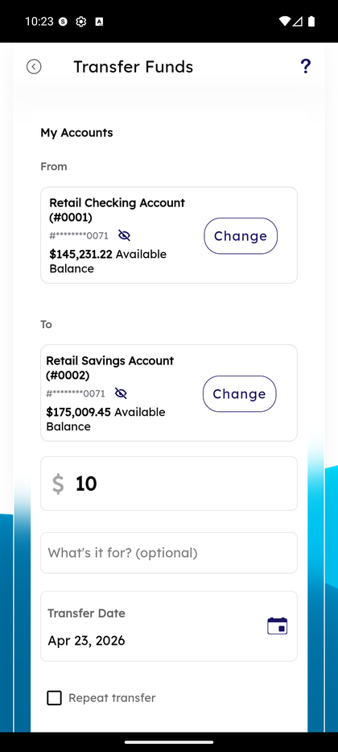
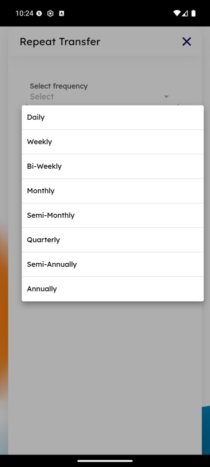
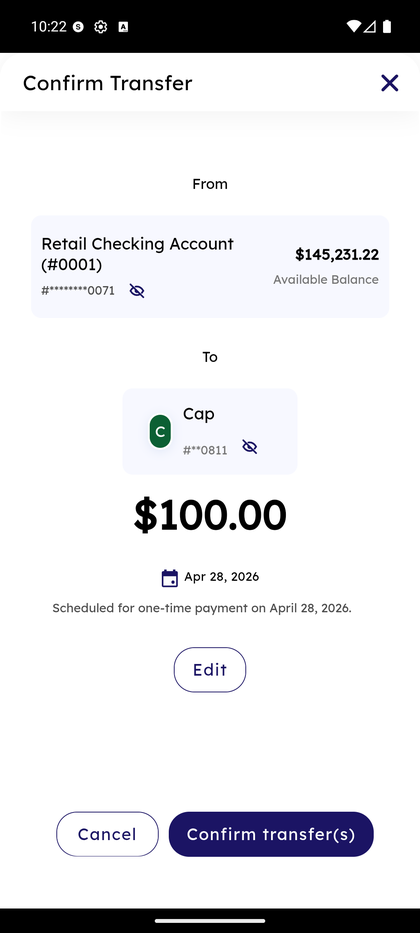
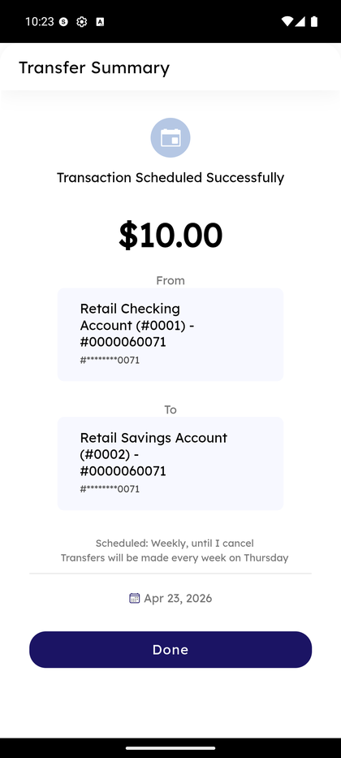

# Transfer Funds — Internal & Other Members

_Summerville Mobile › Move Money › Transfer Funds_

## Move Money: Transfer Funds (Internal & Other Members)

> The simplest transfers on Summerville Mobile. Two flavors live in the same Transfer Funds shell: **Internal Transfers** (between your own Summerville accounts — instant) and **Other Members** (to another Summerville member by member number — also instant, since both sides are on the same core). One form, one confirm, one success screen.

**How to get here:** Bottom navigation → **Move Money** → **Internal Transfers** (own accounts) or **Other Members** (another Summerville member)

### Step-by-Step Workflow

#### Step 1: Open Transfer Funds From Move Money

Tap **Move Money** in the bottom nav, then tap **Internal Transfers** (for own-account moves) or **Other Members** (for intra-credit-union sends). Both land on the Transfer Funds screen — the only difference is the label shown at the top and which recipients appear in the picker.

#### Step 2: Select the Source Account

The **From** field shows a scrollable picker titled **Select source account**. Your Summerville accounts are listed — **Retail Checking Account (#0001)** and **Retail Savings Account (#0002)** — each with masked member number and **Available Balance**. Tap one to pick it.

#### Step 3: Pick a Recipient

The **To** field prompts *"Select a recipient"* as a purple button. Tapping it opens a search-for-accounts picker with **Recent Accounts** at the top. For **Internal Transfers**, your other Summerville accounts appear here (e.g., Retail Savings when the source is Checking). For **Other Members**, saved within-Summerville recipients like **Cap (#0001) - #60811 (Within Summerville)** appear.

#### Step 4: Enter Amount, Description, Transfer Date

Fill in the **amount** (e.g., *$10.00* or *$100*), optional **What's it for?** description that lives on the transaction record, and **Transfer Date** defaulting to today. Tap the date field to open the calendar picker if you want to schedule for a future date.

#### Step 5: (Optional) Set Repeat Transfer — Frequency

Tick the **Repeat transfer** checkbox below Transfer Date to turn this into a recurring transfer. The **Repeat Transfer** sheet opens with **Select frequency** (dropdown) and **End on** (dropdown) fields empty. Tap the frequency dropdown to expand the 8 options: **Daily, Weekly, Bi-Weekly, Bi-Monthly, Monthly, Quarterly, Semiannually, Annual**.

#### Step 6: (Optional) Set End Condition

Tap the **End on** dropdown to pick one: **End Date** (you pick a calendar date when it stops) or **Until I Cancel** (runs indefinitely, most common). With both fields filled (e.g., *Weekly*, *Until I Cancel*), tap **Save** to apply; **Cancel** discards.

#### Step 7: Tap Transfer Funds

Back on the Transfer Funds form with everything filled (From, To, amount, date, optional frequency), tap the **Transfer Funds** button at the bottom.

#### Step 8: Confirm Transfer

The Confirm screen shows the full summary: **From** card, **To** card, amount (e.g., **$100.00**), **Apr 28, 2026** date, and the line *"Scheduled for one-time payment on April 28, 2026."* (For recurring, it reads *"Scheduled: Weekly, until I cancel — Transfers will be made every week on Thursday."*) **Edit** returns to the form, **Cancel** discards, **Confirm transfer(s)** commits.

#### Step 9: Transfer Summary — Success

On commit you land on **Transfer Summary**: calendar icon + *"Transaction Scheduled Successfully"*, the amount, From / To cards, schedule language, and the next-occurrence date. **Done** returns to Move Money.

### Summary

Internal transfers are the no-friction case — no scam warnings, no ACH timing caveats, no OTP. Other Members transfers are almost as fast because both accounts sit on the same core, so the money is available to the recipient instantly. The same Transfer Funds shell handles all internal-adjacent flows (own-account, other-member) and external transfers too, so you learn one mental model that scales. The Repeat Transfer sheet is optional and only appears if you tick the checkbox — most members use one-time transfers and never touch frequencies.

### Key Use Cases

* Move paycheck overflow into savings: From = Retail Checking, To = Retail Savings, amount, Transfer Funds. Done in 4 taps.
* Pay another Summerville member (e.g., rent-split with a roommate who also banks here): Other Members → their member number → instant settlement.
* Weekly auto-sweep to savings: Step 5 frequency = Weekly, End on = Until I Cancel → set once, runs forever.
* Schedule a future transfer: pick a Transfer Date past today → transfer runs on that date.
