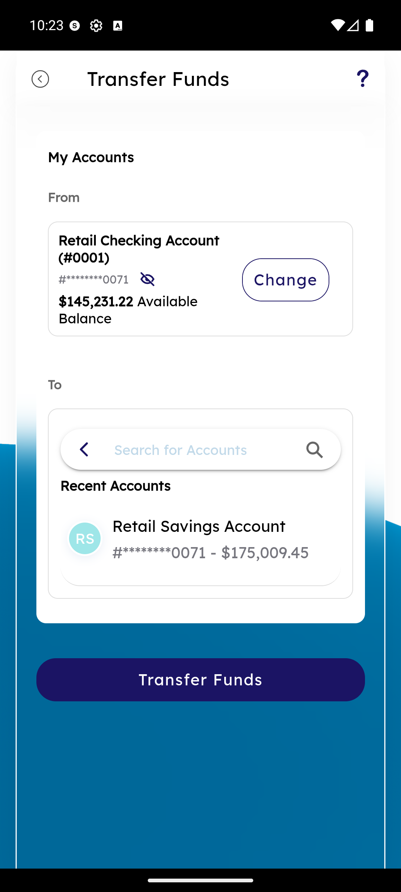
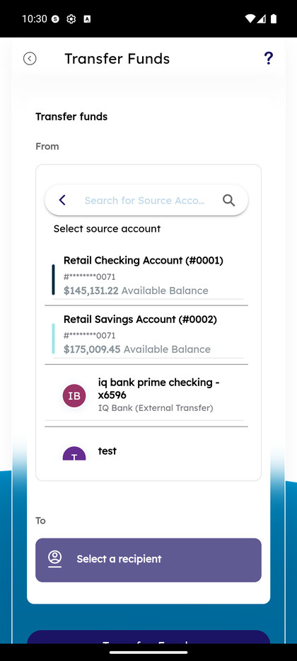
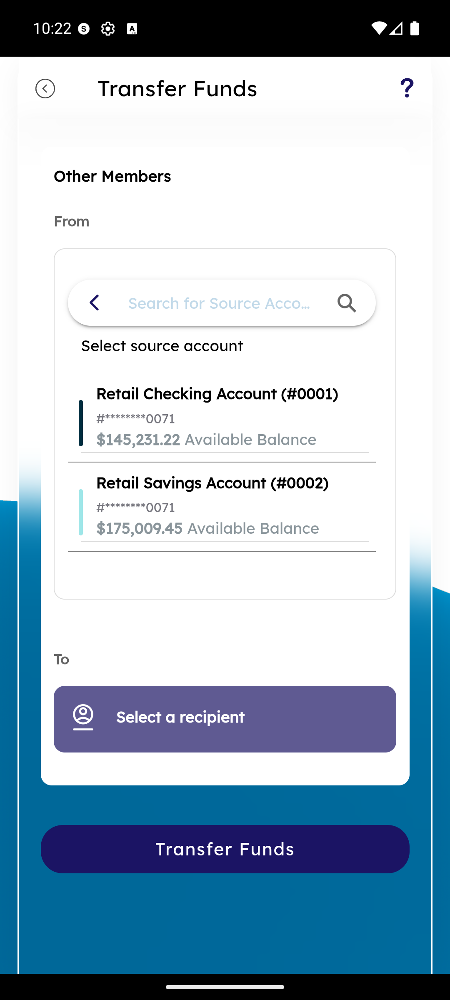
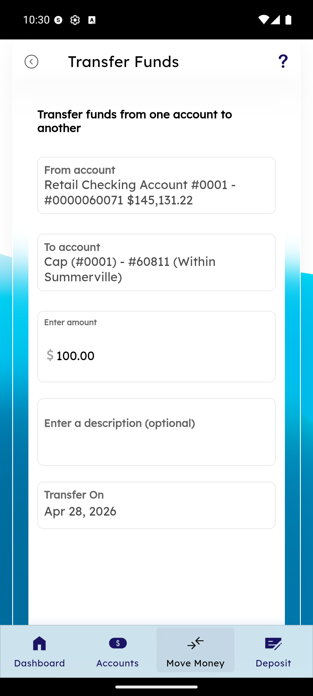
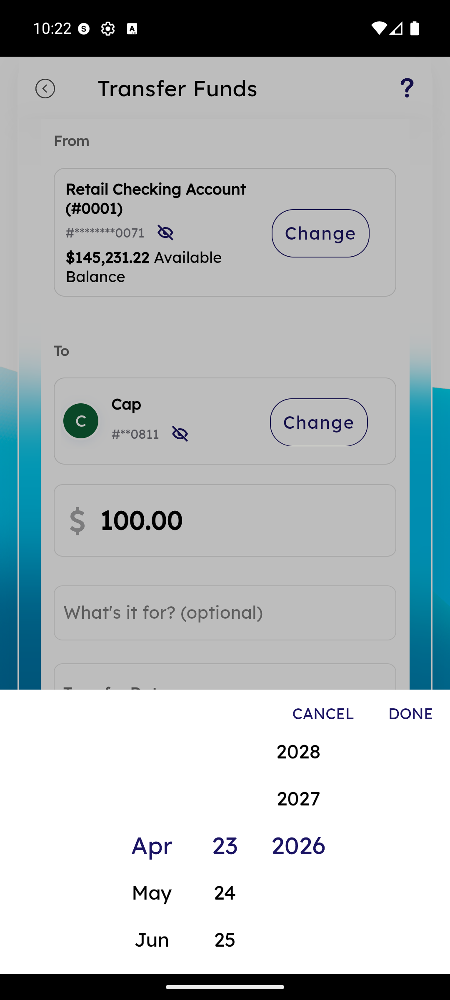

# Transfer Funds — Internal & Other Members

_Summerville Mobile › Move Money › Transfer Funds (Internal)_

## Move Money: Transfer Funds — Internal (Own-Account & Other Members)

> The simplest money-movement in the app — between Summerville accounts — and the member-to-member variant for transferring to another Summerville member's account.

### Step-by-Step Workflow

#### Step 1: Transfer Funds — Select From and To

The screen defaults to the member's primary checking as the From account and shows available balance inline. The To field is a search-for-accounts picker with **Recent Accounts** surfaced first — for own-account, the member's savings will typically appear at the top of Recent.

#### Step 2: Review Source Picker

The scrollable source picker shows **Retail Checking (#0001)**, **Retail Savings (#0002)**, and any external recipients already on file (e.g., *iq bank prime checking*). Internal transfers commit instantly with no timing caveats; external transfers show ACH/FedNow timing on confirmation.

#### Step 3: Transfer to Another Summerville Member

Tapping **Other Members** in the To picker switches the destination to a member-to-member transfer. The form shows the From account and prompts **Select a recipient** at the bottom. Member-to-member transfers need the recipient's member number — this flow is the same Transfer Funds shell but routes intra-credit-union rather than through ACH rails.

#### Step 4: Within Summerville Transfer Form

On the completed Transfer Funds form for a within-Summerville recipient (e.g., **Cap (#0001) - #60811 (Within Summerville)**), enter the amount, optional description, and Transfer On date. **Transfer Funds** commits; the destination member sees the deposit instantly because both sides are on the same core.

#### Step 5: Pick Transfer Date

Tapping the Transfer Date field opens a calendar wheel picker: month, day, and year columns (e.g., Apr / 23 / 2026 with the selected date in bold). **CANCEL** exits, **DONE** commits the date selection back to the form.

### Summary

Own-account transfers are the no-friction case — no recipient setup, no same-day cutoff warnings, no timing language. Other Members transfers are almost as fast because they're intra-core and settle instantly, but they do require the recipient's member number upfront (the credit union's privacy posture prevents searching other members by name). The UI uses one Transfer Funds shell for all three rails (own-account, other-member, external) so members learn one mental model that scales from the simple case to the complex.

### Key Use Cases

* Move paycheck overflow into savings: From = Checking, To = Savings, done.
* Pay another Summerville member (rent split with a roommate who also banks here): Other Members, enter their member number, instant settlement.
* Schedule a future transfer: use the calendar wheel to pick a date past today; transfer runs on that date.
