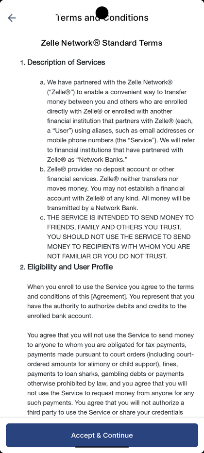
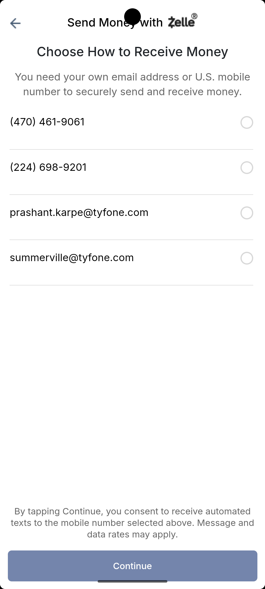
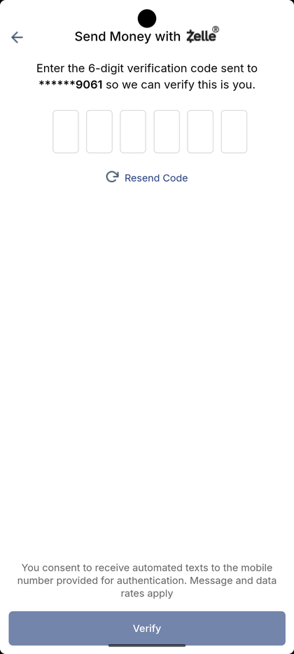

# Zelle Send Money

_Summerville Mobile › Move Money › Zelle_

## Move Money: Zelle — Send Money to Friends & Family

> Zelle is the person-to-person rail in the Move Money hub. First-time setup has four quick steps (splash → terms → pick your receive endpoint → OTP verify) and after that every send is just recipient + amount + OTP.

**How to get here:** Bottom navigation → **Move Money** → **Zelle**

### Step-by-Step Workflow

#### Step 1: Zelle Splash — Move Money in the Moment

The first time you open Zelle, you'll see the branded welcome screen: the Zelle logo, a hero image, the tagline *"Move money in the moment — Simply and securely — with people and businesses you know."* and a **Get Started** button at the bottom. Tap **Get Started**.

#### Step 2: Accept the Zelle Terms and Conditions

The Terms & Conditions screen appears — Zelle Network® Standard Terms — with sections covering Description of Services, Eligibility and User Profile, and the important notes about only sending to people you know and trust. Scroll to read, then tap **Accept & Continue** at the bottom. This only happens once per member, not per transaction.

#### Step 3: Choose How to Receive Money

Pick the endpoint at which other people will send you money — an email or a US mobile number from your on-file list (e.g., *(470) 461-9061, (224) 698-9201, prashant.karpe@tyfone.com, summerville@tyfone.com*). Only one endpoint can be your Zelle identity at a time, though you can change it later in Zelle settings. Tap the endpoint row to select, then **Continue**.

#### Step 4: Enter 6-Digit Verification Code

Every send requires a one-time code to the phone number on file. The app sends an OTP (last 4 digits shown, e.g., `******9061`) and presents an entry field. Type the six digits and tap **Verify**. If the code doesn't arrive, tap **Resend Code**. The fine print at the bottom is the Zelle SMS-consent notice required by law.

### Summary

Zelle is the fastest way to send money to someone who banks anywhere else — provided they're also enrolled in Zelle, which most US banks now are. The OTP step on every transaction is the fraud control that makes Zelle safe enough to leave irreversible: even if someone stole your phone and could open the app, they'd still need your SMS. If your OTP isn't arriving, the fix is almost always a stale phone number — go to Profile → Update Phone Number before trying again. Zelle sends settle in minutes and are effectively non-reversible, so confirm the recipient carefully.

### Key Use Cases

* Sending rent to a roommate: tap Zelle → pick recipient (or add their email/phone) → amount → OTP → verified.
* First-time enrollment: splash → T&C → pick receive endpoint → continue, ready to send and receive.
* Phone number changed but not updated in-app: OTP won't land; update the number first, re-attempt the Zelle send.
