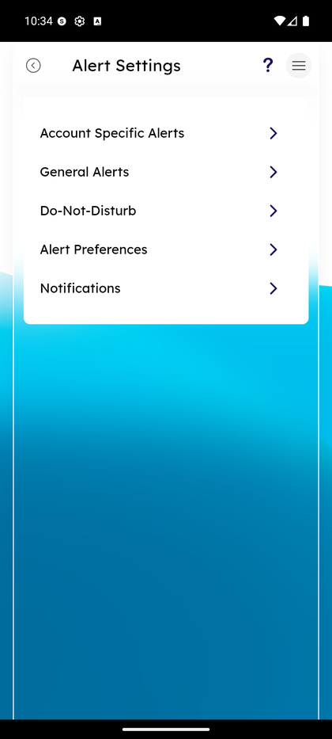
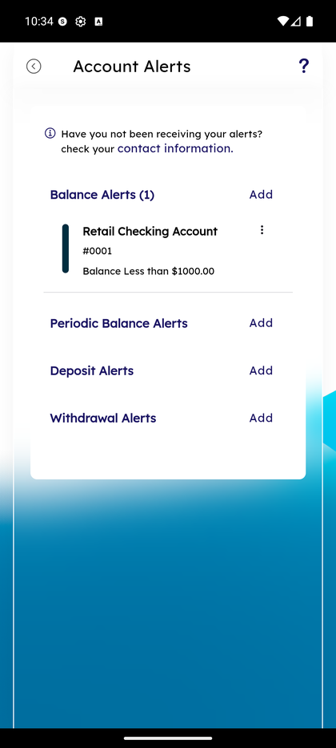
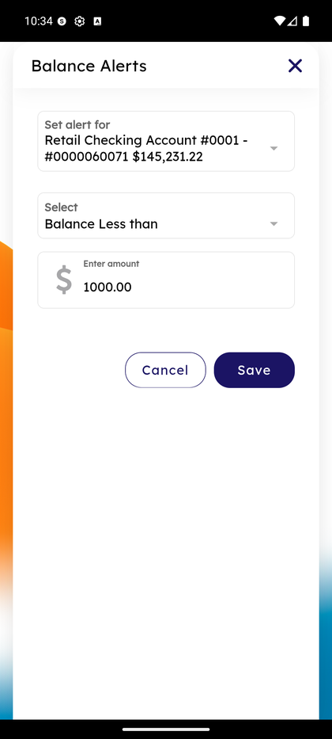
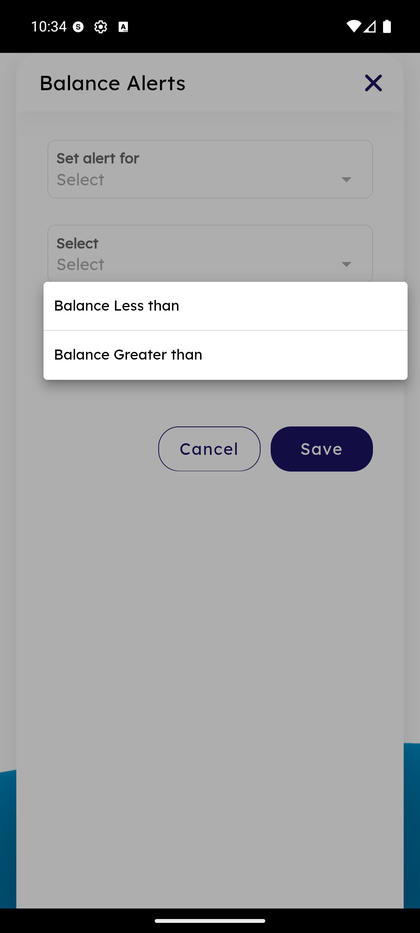
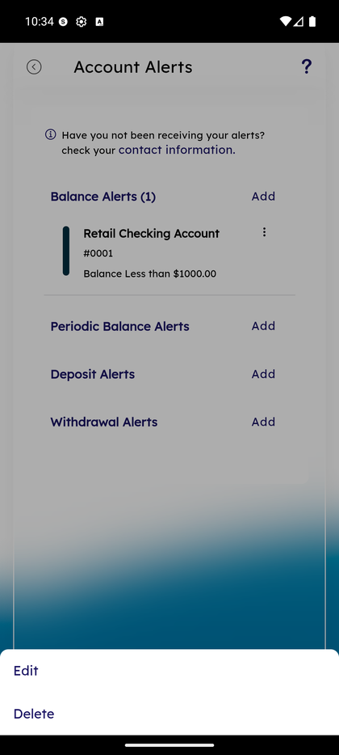
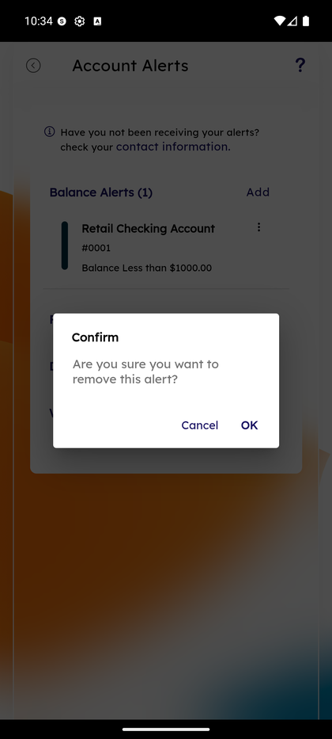
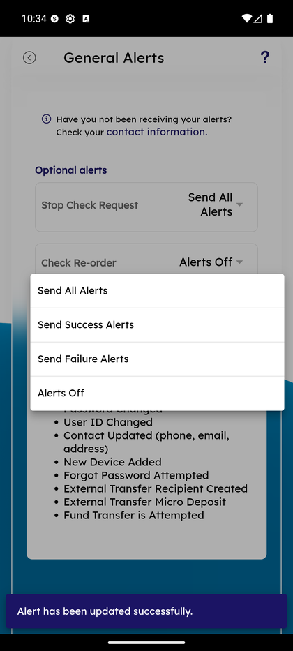

# Account Alerts

_Summerville Mobile › Profile & Preferences › Account Alerts_

## Profile & Preferences: Account Alerts

> Self-service alert configuration — balance thresholds, deposits, withdrawals — with per-alert **Edit** and **Delete** actions in a long-press sheet, a confirm dialog on delete, and a parallel General Alerts surface for security events with mandatory + optional sub-categories.

**How to get here:** Side Menu (☰) → **Alert Settings** → **Account Specific Alerts**

### Step-by-Step Workflow

#### Step 1: Open the Side Menu

Tap the **☰** hamburger icon at the top-right of any screen.

#### Step 2: Tap Alert Settings

In the Side Menu, tap **Alert Settings — Manage your alert preferences**.

#### Step 3: Tap Account Specific Alerts

On the Alert Settings hub, tap **Account Specific Alerts** (the first row).

#### Step 4: Account Alerts Home — Categories with Counts

The Account Alerts screen shows the info note *"Have you not been receiving your alerts? check your contact information."* **Balance Alerts** shows a count of active alerts per account (e.g., **Retail Checking (#0001) — Balance Less than $1000.00**). **Periodic Balance Alerts**, **Deposit Alerts**, and **Withdrawal Alerts** appear below as four parallel rows, each with an **Add** action.

#### Step 5: Create a Balance Alert — Pick Account and Threshold Type

Tapping Add opens the **Balance Alerts** modal. First dropdown: **Set alert for** → pick an account (e.g., *Retail Checking Account #0001 — $145,231.22*). Second dropdown: threshold type — **Balance Less than** or **Balance Greater than**.

#### Step 6: Enter Threshold Amount and Save

Enter the dollar threshold (e.g., **1000.00**) in the amount field and tap **Save**. The alert is created immediately and shows in the Account Alerts home count.

#### Step 7: Edit or Delete an Existing Alert

Long-press an existing alert row to open the bottom action sheet with **Edit** and **Delete**. Edit re-opens the alert form; Delete confirms removal in Step 8.

#### Step 8: Confirm Delete

If you tap Delete in Step 7, a **Confirm** dialog appears: *"Are you sure you want to remove this alert?"* with **Cancel** and **OK**. Tap **OK** to remove the alert; **Cancel** to keep it.

#### Step 9: General Alerts — Optional + Mandatory

Back on the Alert Settings hub, tap **General Alerts**. The screen splits into two sections. **Optional alerts** are user-controllable per-row dropdowns. Tap any optional row's dropdown (e.g., *Stop Check Request*) and four options appear: **Send All Alerts**, **Send Success Alerts**, **Send Failure Alerts**, **Alerts Off**. A success bar reads *"Alert has been updated successfully"* after each change. **Mandatory alerts** below (Failed Login Attempted, Unlock Account Attempted, Account Locked, Password Changed, User ID Changed, Contact Updated, New Device Added, Forgot Password Attempted, External Transfer Recipient Created, External Transfer Micro Deposit, Fund Transfer is Attempted) are always on and cannot be disabled — they're listed for transparency.

### Summary

Alerts are split between **Account Specific** (what you choose to be alerted about on your accounts) and **General** (security alerts, many mandatory). Within Account Specific you can Edit or Delete any alert via long-press; the confirm-on-delete dialog is the guardrail. Within General the Optional rows give you four delivery levels (All / Success / Failure / Off) per category, while Mandatory rows are listed for transparency but always-on. The success-bar feedback after every change confirms the update committed without forcing a screen reload.

### Key Use Cases

* Freelancer pings on every deposit: Deposit Alerts → Add → Retail Checking → any amount.
* Low-balance guardrail: Balance Alerts → Add → Less than → $1000.
* Stop noisy Stop Check Request alerts: General Alerts → Stop Check Request dropdown → **Alerts Off**.
* Member asks "why did I get this alert I didn't configure": it's a mandatory security alert — point them to the General Alerts list showing it can't be turned off.
* Member wants to remove an old low-balance alert: long-press → Delete → OK in Confirm.
