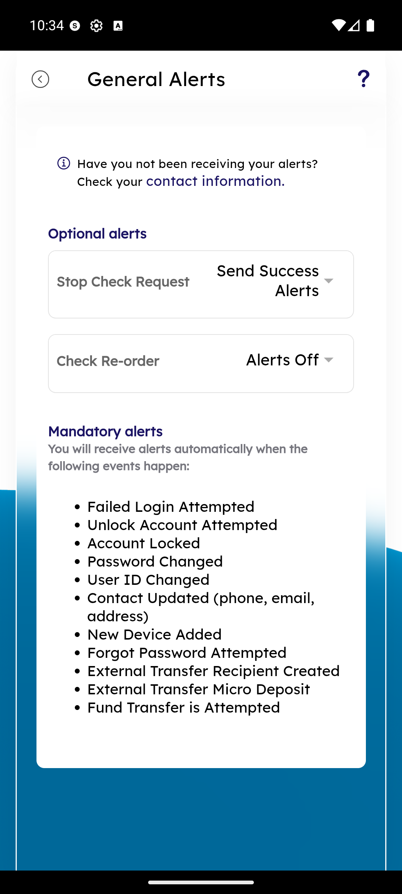

# Account Alerts

_Summerville Mobile › Profile & Preferences › Account Alerts_

## Profile & Preferences: Account Alerts

> Self-service alert configuration — balance thresholds, deposits, withdrawals, and a separate General Alerts surface for security events that can't be disabled.

### Step-by-Step Workflow

#### Step 1: Account Alerts Home

The Account Alerts screen shows the info note *"Have you not been receiving your alerts? check your contact information."* — that link is the operational escape hatch when alerts exist but aren't delivering. **Balance Alerts** shows a count of active alerts per account (e.g., **Retail Checking (#0001) — Balance Less than $1000.00**); tap **Add** on any row to create a new alert for that category.

#### Step 2: Create a Balance Alert — Pick Account and Threshold Type

Tapping Add opens the **Balance Alerts** modal. First dropdown: **Set alert for** → pick an account (e.g., *Retail Checking Account #0001 - #0000060071 $145,231.22*). Second dropdown: threshold type — **Balance Less than** or **Balance Greater than**.

#### Step 3: Enter Threshold Amount

Enter the dollar threshold (e.g., **1000.00**) in the amount field and tap **Save**. The alert is created immediately and shows in the Account Alerts home count. **Cancel** discards without saving.

#### Step 4: Review General Alerts (Mandatory vs Optional)

Navigate to **General Alerts** (accessible from the Side Menu → Alert Settings). The screen splits alerts into two sections. **Optional alerts** (user-controllable dropdowns): Stop Check Request, Check Re-order. **Mandatory alerts** (always on, cannot be disabled — listed for transparency): Failed Login Attempted, Unlock Account Attempted, Account Locked, Password Changed, User ID Changed, Contact Updated (phone, email, address), New Device Added, Forgot Password Attempted, External Transfer Recipient Created, External Transfer Micro Deposit, Fund Transfer is Attempted.

### Summary

Alert categories are grouped by event type (Balance, Deposit, Withdrawal) rather than by account — this matches how members think about notifications. The **mandatory** category in General Alerts is a compliance-and-fraud control: the FI is required to notify the member of every security-relevant change (login failures, credential changes, new devices, new external recipients) regardless of member preference, so those alerts are listed for transparency but not toggleable. Balance and transaction alerts are fully member-controlled.

### Key Use Cases

* Freelancer pings on every deposit: Deposit Alerts → Add → Retail Checking → any amount.
* Low-balance guardrail: Balance Alerts → Add → Less than → $1000.
* Member asks "why did I get this alert I didn't configure": it's a mandatory security alert — point them to the General Alerts list showing it can't be turned off.
