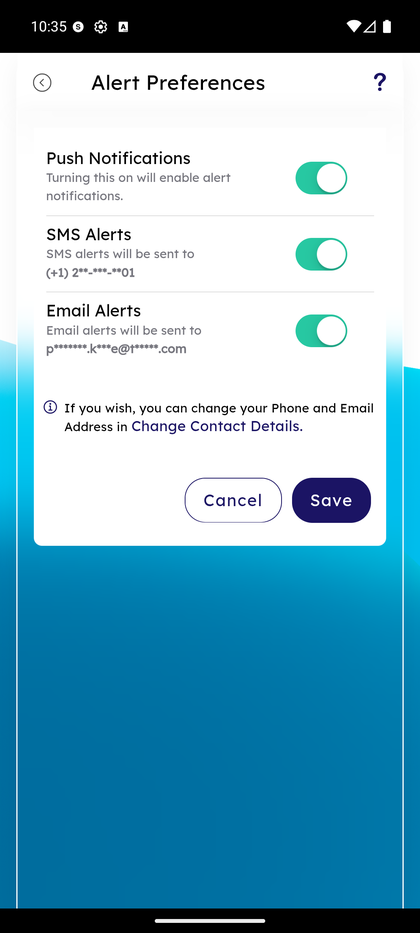

# Alert Preferences

_Summerville Mobile › Profile & Preferences › Alert Preferences_

## Profile & Preferences: Alert Preferences (Delivery Channels)

> The channel-level delivery switch for alerts — Push, SMS, or Email. This is where you choose **how** alerts reach you, independent of **what** alerts are configured (which lives in Account Specific Alerts and General Alerts).

**How to get here:** Side Menu (☰) → **Alert Settings** → **Alert Preferences**

### Step-by-Step Workflow

#### Step 1: Open the Side Menu

Tap the **☰** hamburger icon at the top-right of any screen.

#### Step 2: Tap Alert Settings → Alert Preferences

In the Side Menu, tap **Alert Settings**, then tap **Alert Preferences** (the fourth row on the Alert Settings hub).

#### Step 3: Toggle Push / SMS / Email Channels

Three toggles, each with the current delivery endpoint shown:
- **Push Notifications** — *"Turning this on will enable alert notifications."* (Device-level toggle; respects your OS notifications settings.)
- **SMS Alerts** — *"SMS alerts will be sent to (+1) 2\*\*-\*\*\*-\*\*01"* (the phone number on file).
- **Email Alerts** — *"Email alerts will be sent to p\*\*\*\*\*\*.k\*\*\*e@t\*\*\*\*\*.com"* (the email on file).

A note below reads *"If you wish, you can change your Phone and Email Address in Change Contact Details"* — tap the link to jump to Personal Information. Tap **Save** to commit or **Cancel** to discard.

### Summary

Alert Preferences is the delivery-channel layer on top of the alert categories you configured elsewhere. Turning off a channel here silences every alert that would have used it — including mandatory security alerts — so think of this as the global on/off for each channel, not a per-category filter. For that reason, most members keep all three toggles on and fine-tune the actual alerts in Account Specific Alerts and General Alerts. The masked endpoints (phone last 2, email partial) are a privacy-friendly way to confirm the right number/address is on file without showing it in the clear.

### Key Use Cases

* Member temporarily silences push (e.g., on vacation): toggle Push Notifications off at Alert Preferences, leave SMS and Email on as fallback.
* Member wants to stop email clutter but keep push alive: toggle Email Alerts off.
* Member confirms the phone/email SMS and email go to: the masked endpoint on each toggle row tells them, no navigation needed.
