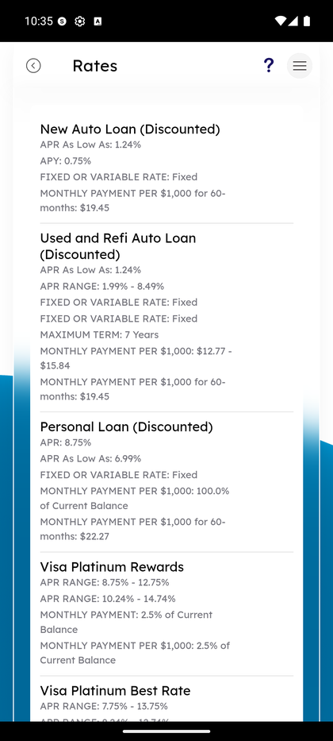

# Apply for Loans

_Summerville Mobile › Profile & Preferences › Apply for Loans_

## Profile & Preferences: Apply for Loans

> Entry point for loan-related tools — financial calculators for planning and the current rates sheet. The Rates page lists every loan and deposit product with its APR/APY and monthly payment example.

**How to get here:** Side Menu (☰) → **Apply for Loans**

### Step-by-Step Workflow

#### Step 1: Open the Side Menu

Tap the **☰** hamburger icon at the top-right of any screen.

#### Step 2: Tap Apply for Loans

In the Side Menu, tap **Apply for Loans**.

#### Step 3: Pick Calculators or Rates

The Apply for Loans screen lists two rows: **Calculators** (loan, savings, and retirement calculators hosted as a Tyfone webview) and **Rates** (the current rates sheet for Summerville's loan and deposit products).

#### Step 4: Browse Rates by Product

Tapping **Rates** opens the rates sheet — a scrollable list of every loan and deposit product with key terms. Examples:
- **New Auto Loan (Discounted)** — APR As Low As 1.24%, APY 0.75%, Fixed Rate, Monthly Payment per $1,000 for 60 months: $19.45.
- **Used and Refi Auto Loan (Discounted)** — APR Range 1.99% – 8.49%, Fixed Rate, Maximum Term 7 years.
- **Personal Loan (Discounted)** — APR 8.75%, APR As Low As 6.99%, Fixed Rate.
- **Visa Platinum Rewards** — APR Range 8.75% – 12.75%.
- **Visa Platinum Best Rate** — APR Range 7.75% – 13.75%.

Use these for member-facing pricing reference; they're updated whenever Summerville's rate desk publishes a change.

### Summary

Apply for Loans is the planning surface, not the apply surface — despite the name, this screen doesn't submit a loan application itself. Use Calculators to run a what-if (mortgage affordability, auto loan payment schedule, etc.) and Rates to see current pricing. The actual loan application is handled either through a secure-message request to support (via Help → Connect With Us) or by visiting a branch.

### Key Use Cases

* Member thinking about a car purchase: Calculators → Auto Loan → enter amount, rate, term — see monthly payment.
* Member comparing Summerville's HELOC rate: Rates → HELOC → see current APR.
* Planning retirement contributions: Calculators → Compound Interest / Retirement — model scenarios before committing.
* Quick rate lookup before a branch visit: Rates → scroll to the product, jot the APR.
