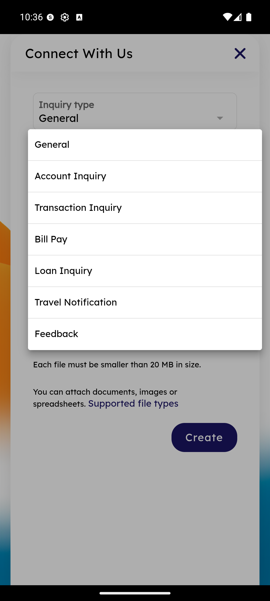

# Connect With Us — New Ticket

_Summerville Mobile › Profile & Preferences › Connect With Us (New Ticket)_

## Profile & Preferences: Connect With Us — New Secure-Message Ticket

> The ticket-creation form inside Help — pick an inquiry type from a fixed taxonomy, attach files, and create a ticket that routes to the right support queue server-side.

### Step-by-Step Workflow

#### Step 1: Pick Inquiry Type

Tap **Connect with us** from the Help screen. The **Connect With Us** form opens with **Inquiry type** at the top (defaults to **General**). Tap the dropdown to pick a more specific category — options: **General**, **Account Inquiry**, **Transaction Inquiry**, **Bill Pay**, **Loan Inquiry**, **Travel Notification**, **Feedback**. The category routes the ticket to the right queue, so picking the specific one (instead of General) speeds response time.

#### Step 2: Attach Files and Create

Below the category, an attachment block states *"Each file must be smaller than 20 MB in size. You can attach documents, images or spreadsheets"* with a **Supported file types** link. Attach anything relevant (photo of a receipt for a Transaction Inquiry, statement PDF for an Account Inquiry, etc.) and tap **Create** to submit the ticket.

### Summary

The fixed-taxonomy inquiry type is the single biggest driver of support response time — a Transaction Inquiry with the right category and a receipt photo attached routes straight to the transactions team and often closes in one reply; a General inquiry requires triage first. Train members (and support staff who handle escalations) to always pick the specific category rather than defaulting to General. The 20MB attachment limit is generous enough for most supporting documents; for larger evidence packages, advise members to compress or split.

### Key Use Cases

* Member disputing a charge: Inquiry type = Transaction Inquiry, attach receipt photo, Create — lands on the dispute queue.
* Travel notification when the in-card Travel Notice feature isn't enough: Inquiry type = Travel Notification, free-text travel detail, Create — ops reviews and applies manual flags.
* Member reporting a bug or feature request: Inquiry type = Feedback — this is the long-form cousin of the Dashboard Feedback sheet.
