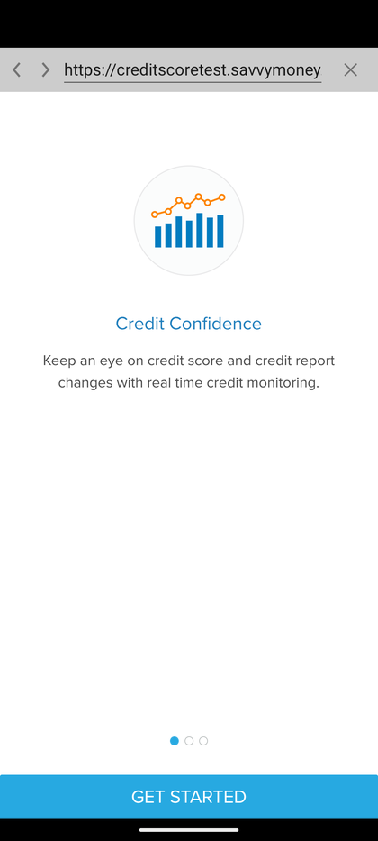
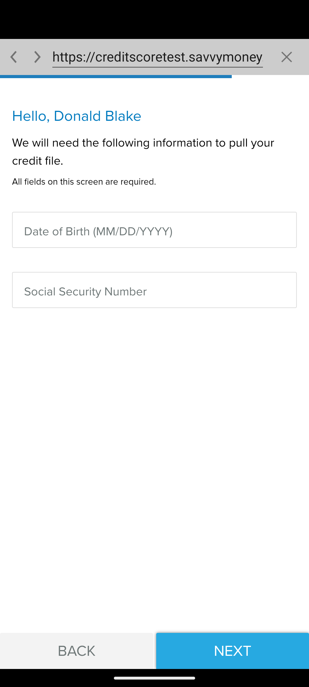
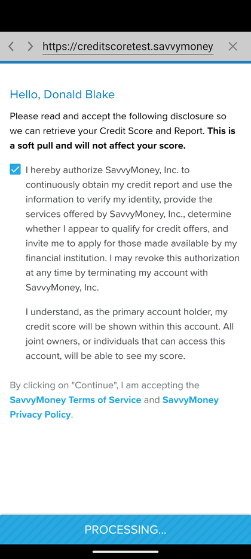

# Credit Score (SavvyMoney)

_Summerville Mobile › Profile & Preferences › Credit Score (SavvyMoney)_

## Profile & Preferences: Credit Score — SavvyMoney Enrollment

> The first-time credit-score enrollment hands off to SavvyMoney via an in-app webview; the initial form collects the DOB and SSN that SavvyMoney needs to pull the bureau file.

**How to get here:** Side Menu (☰) → **Credit Score**

### Step-by-Step Workflow

#### Step 1: Open the Side Menu

Tap the **☰** hamburger icon at the top-right of any screen.

#### Step 2: Scroll Down and Tap Credit Score

Scroll the Side Menu past the main navigation rows. Tap **Credit Score — View your Credit Score and a detailed analysis on it** (near the bottom of the menu).

#### Step 3: Review Credit Confidence Intro

On first enrollment, a Credit Confidence splash loads in an embedded webview: bar-chart illustration, heading *"Credit Confidence — Keep an eye on credit score and credit report changes with real time credit monitoring."* Tap **GET STARTED**.

#### Step 4: Identity Verification (DOB + SSN)

The webview greets you with *"Hello, &lt;Member Name&gt;"* and asks for **Date of Birth (MM/DD/YYYY)** and **Social Security Number**. Both are required to pull the credit file. The URL bar (`https://creditscoretest.savvymoney.`) makes the third-party handoff visible. **NEXT** advances to the pull; **BACK** returns to the More Menu without creating an enrollment.

#### Step 5: Accept Disclosure and Pull Score

On the next screen, you'll see the SavvyMoney disclosure: *"Please read and accept the following disclosure so we can retrieve your Credit Score and Report. This is a soft pull and will not affect your score."* Tick the *"I hereby authorize SavvyMoney, Inc. to continuously obtain my credit report..."* checkbox and tap **Continue**. The webview processes and surfaces your credit score within about a minute.

### Summary

Credit Score is an opt-in SavvyMoney integration, not a native feature — your DOB and SSN are captured once during enrollment and then the ongoing score refreshes happen silently without re-entry. Because the form is in a webview to an external vendor, members sometimes hesitate at the SSN field; the correct support script confirms SavvyMoney is a vetted third party and that the credit pull is a **soft inquiry** that doesn't affect the score.

### Key Use Cases

* First-time enrollment: Side Menu → Credit Score → Get Started → DOB + SSN → accept disclosure → score in a minute.
* Returning to the feature after enrollment: no identity form; score loads directly.
* Member declines: **BACK** exits without creating an enrollment; Credit Score stays available to try again later.
