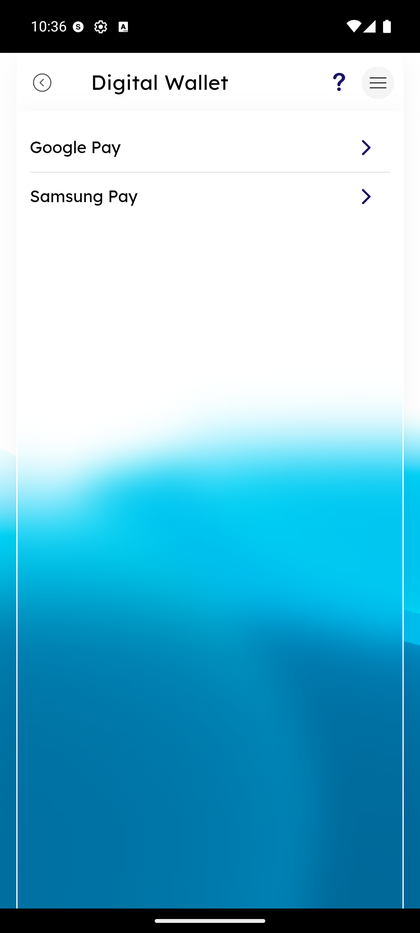

# Digital Wallet

_Summerville Mobile › Profile & Preferences › Digital Wallet_

## Profile & Preferences: Digital Wallet

> Link your Summerville debit or credit card to your phone's native wallet (Google Pay or Samsung Pay) so you can pay with a tap at any contactless terminal.

### Step-by-Step Workflow

#### Step 1: Open the Side Menu

Tap the **☰** hamburger icon at the top-right of any screen.

#### Step 2: Tap Digital Wallet

In the Side Menu, tap **Digital Wallet — Pay using Digital Wallet** (in the upper half of the menu).

#### Step 3: Pick Google Pay or Samsung Pay

The Digital Wallet screen offers two options: **Google Pay** and **Samsung Pay**. Tap the one that matches your phone.

#### Step 4: Complete Wallet Provisioning

The OS-native Wallet handoff runs. iOS opens Apple Pay provisioning; Android opens Google Wallet. Tap through the issuer verification (usually a one-tap approval because the app has already established device trust) and the tokenized card appears in your Wallet, ready for contactless payment.

### Summary

Adding your Summerville card to Google Pay or Samsung Pay takes about 30 seconds and means you never have to carry the physical card again for in-store purchases. If you ever lose your physical card, your wallet token keeps working until the replacement arrives. Apple Pay uses a different entry point (the Wallet app adds the card directly) and isn't shown here.

### Key Use Cases

* New card just arrived: activate it first, then add to your phone's wallet for contactless use.
* Leaving the physical card at home: wallet token works at any contactless terminal.
* Lost physical card mid-trip: report the card lost/stolen — the wallet token continues to work until the replacement arrives.
