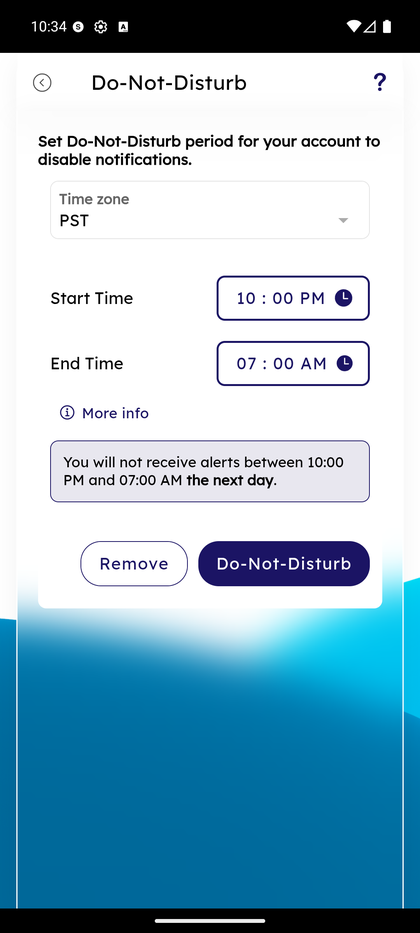

# Do-Not-Disturb Period

_Summerville Mobile › Profile & Preferences › Do-Not-Disturb Period_

## Profile & Preferences: Do-Not-Disturb Period

> A per-member quiet window — no push or SMS alerts during the configured hours — that respects your sleep schedule without turning off alerts entirely.

**How to get here:** Side Menu (☰) → **Alert Settings** → **Do-Not-Disturb**

### Step-by-Step Workflow

#### Step 1: Open the Side Menu

Tap the **☰** hamburger icon at the top-right of any screen.

#### Step 2: Tap Alert Settings

In the Side Menu, tap **Alert Settings — Manage your alert preferences**.

#### Step 3: Tap Do-Not-Disturb

On the Alert Settings hub, tap **Do-Not-Disturb** (third row).

#### Step 4: Set the Quiet Window

Pick the **Time zone**, **Start Time**, and **End Time**. The preview banner below the fields confirms the effective window in plain language (e.g., *"You will not receive alerts between 10:00 PM and 07:00 AM the next day"*). **Do-Not-Disturb** applies the window; **Remove** clears it entirely. **More info** expands an inline help section explaining what categories are (and aren't) suppressed.

### Summary

Do-Not-Disturb is a time-based suppressor, not a category filter — alerts continue to fire and land in the in-app inbox, they just don't push to the device during the window. That matters for compliance: fraud and security alerts are intentionally exempt from DND (they always push), so members in high-risk scenarios aren't silenced when the bank most needs to reach them.

### Key Use Cases

* Member on a night-shift rotation: set Start = 09:00 AM, End = 05:00 PM.
* Sleep-mode defaults: 10 PM to 7 AM works for most members with no further tuning.
* Traveling across time zones: change the **Time zone** selector to the destination before flying so the window applies locally.
