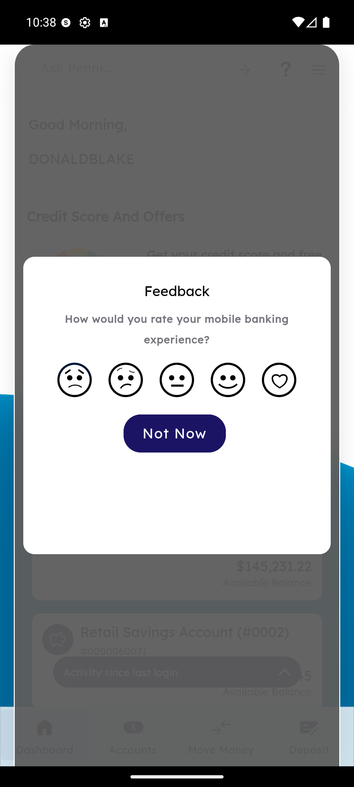

# Feedback Prompt

_Summerville Mobile › Profile & Preferences › Feedback Prompt_

## Profile & Preferences: Feedback Prompt

> Periodic in-app NPS capture — a 5-point face scale plus an always-available **Not Now** dismiss, surfaced on the Dashboard and rate-limited per member so it never becomes intrusive.

### Step-by-Step Workflow

#### Step 1: Feedback Sheet Surfaces on Dashboard

The **Feedback** sheet overlays the Dashboard with the prompt *"How would you rate your mobile banking experience?"* and a 5-point face scale (sad, frown, neutral, smile, heart). Tapping any face submits the rating and dismisses the sheet; tapping **Not Now** dismisses without submitting. The sheet is modal but the Dashboard behind it stays visible so the member keeps the context of where they were in the app.

### Summary

This is the app's NPS-lite instrument — five faces collapse to a 0–10 NPS proxy on the analytics side while staying lightweight for the member. Rate-limiting is server-driven: a member who dismisses or submits won't see it again for the configured cooldown (typically 30–90 days). Because it's modal on the Dashboard, engineering keeps the trigger rule tight — it only surfaces after a successful high-value action (completed transfer, successful deposit) so the rating captures a satisfaction peak rather than an arbitrary landing.

### Key Use Cases

* Member just deposited a check and saw it post: Feedback sheet surfaces on return to Dashboard, they tap the heart face, NPS gets a promoter datapoint.
* Member in a rush: **Not Now** dismisses and cooldown prevents re-surface.
* Aggregated response feeds Product Analytics dashboards — PMs track NPS trend alongside release notes.
