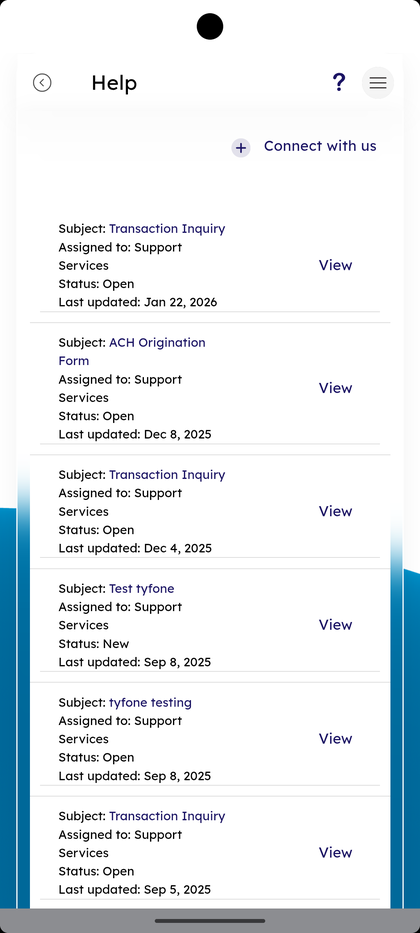

# Help & Support Tickets

_Summerville Mobile › Profile & Preferences › Help & Support Tickets_

## Profile & Preferences: Help & Support Tickets

> The Help screen with four contact channels — Message us, Chat with us, Speak with us, Video call us — and a ticket history list with a Connect with us button to start a new request.

**How to get here:** Side Menu (☰) → **Help**

### Step-by-Step Workflow

#### Step 1: Open the Side Menu

Tap the **☰** hamburger icon at the top-right of any screen.

#### Step 2: Tap Help

In the Side Menu, tap **Help — Support**.

#### Step 3: Pick a Contact Channel

The **Help** screen lists four rows: **Message us**, **Chat with us**, **Speak with us**, and **Video call us**. Tap a row to open that channel.

#### Step 4: Review Existing Tickets

The Help screen also lists every open ticket with **Subject**, **Assigned to: Support Services**, **Status**, and **Last updated** date. Tap **View** on any row to open the thread.

#### Step 5: Start a New Ticket

Tap **+ Connect with us** at the top of the ticket list to open the new-ticket form. Use this for written requests that don't need a live agent.

### Summary

The Help screen is the single entry point for support, with four live channels at the top and the open-ticket history below. Last updated is the signal for whether a ticket is waiting on you or on Support Services. Connect with us at the top of the list creates a new written ticket without leaving the Help screen.

### Key Use Cases

* Member needs a fast answer: **Chat with us** or **Speak with us** for live help.
* Member prefers writing: **Message us** or **+ Connect with us** to file a ticket.
* Member checks status of a prior request: scroll the ticket list, read **Status** and **Last updated**, tap **View** to read the thread.
