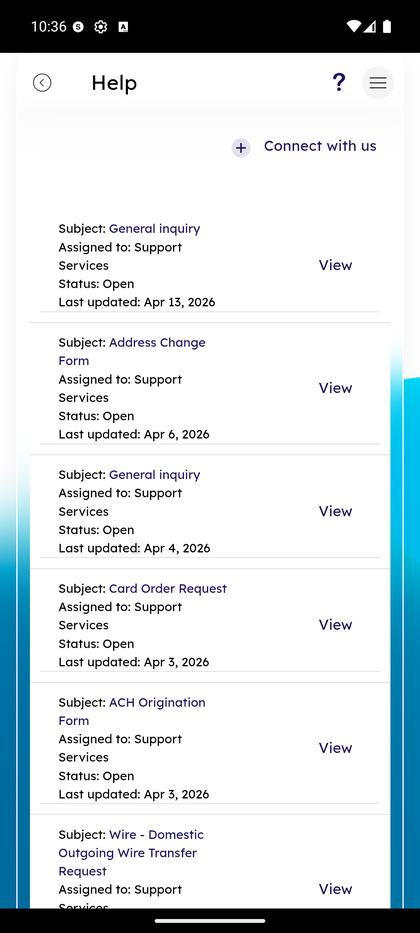

# Help & Support Tickets

_Summerville Mobile › Profile & Preferences › Help & Support Tickets_

## Profile & Preferences: Help & Support Tickets

> The in-app support queue — every secure-message form and service request you've raised, with status and last-updated date, plus a one-tap **Connect with us** button to start a new thread.

**How to get here:** Side Menu (☰) → **Help**

### Step-by-Step Workflow

#### Step 1: Open the Side Menu

Tap the **☰** hamburger icon at the top-right of any screen.

#### Step 2: Tap Help

In the Side Menu, tap **Help — Support**.

#### Step 3: Browse the Tickets List

Each ticket shows **Subject**, **Assigned to: Support Services**, **Status**, and **Last updated** date. Subject lines are the service-request categories (General inquiry, Address Change Form, Card Order Request, ACH Origination Form, Wire — Domestic Outgoing Wire Transfer Request, etc.). Tap **View** on any row to open the full thread. **+ Connect with us** in the top right starts a new ticket.

### Summary

The Help screen is your member-facing view of the same case-management system the FI's support team uses, so "last updated" is the ground-truth signal for whether a ticket is waiting on you or on support. Subject lines double as the operation category, which means ticket triage on the support side can be driven purely by the subject — a pattern the FI's ops team will recognize from the admin console.

### Key Use Cases

* Member wants to know the status of their address change: find the Address Change Form ticket in the list, check Status and Last updated.
* Member needs to initiate a wire: **+ Connect with us** → Wire — Domestic Outgoing Wire Transfer Request → fill and submit.
* Member re-raises an old issue: the old ticket shows Status = Open — re-use it rather than creating a duplicate, so support sees continuity.
