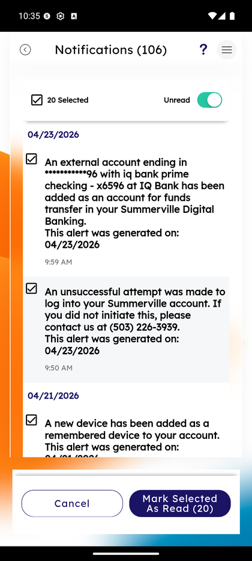

# Inbox & Notifications

_Summerville Mobile › Profile & Preferences › Inbox & Notifications_

## Profile & Preferences: Inbox & Notifications

> The persistent in-app message center — every alert, security notice, and system message lands here, with bulk-read controls and an Unread-only toggle for clearing the backlog.

### Step-by-Step Workflow

#### Step 1: Open the Side Menu

Tap the **☰** hamburger icon at the top-right of any screen.

#### Step 2: Tap Alert Settings

In the Side Menu, tap **Alert Settings**.

#### Step 3: Tap Notifications

On the Alert Settings hub, tap **Notifications** (the last row). The full notifications list loads.

#### Step 4: Browse, Select, and Mark As Read

The **Notifications** screen shows the count in the header (e.g., **Notifications (106)**), a bulk-select checkbox (**20 Selected**), and an **Unread** toggle to filter the view. Each message card shows the date, the full body text, and the generation timestamp. Typical entries: *"An external account ending in ***96 with iq bank prime checking has been added as an account for funds transfer"*; *"An unsuccessful attempt was made to log into your Summerville account"*; *"A new device has been added as a remembered device"*. Bottom bar: **Cancel** (clear selection) and **Mark Selected As Read (N)**.

### Summary

The inbox is the audit trail you own — every security event, alert-generated notice, and system message lives here and stays visible even if the push notification was dismissed. This is the authoritative record when you're troubleshooting "I never got an alert" — the alert almost always landed here even if push delivery failed. Bulk-mark-as-read is deliberately a two-click pattern (select, then Mark Selected) to prevent fat-finger clears of unread security notices.

### Key Use Cases

* Member sees a push alert about a login attempt, clears the push, then wants to revisit: Notifications shows the original with the generation timestamp.
* Member with a backlog of 100+ notifications: filter Unread only, bulk-select all, Mark Selected As Read.
* Security investigation: scroll back to the timestamp of interest and correlate alert text with the core record.
