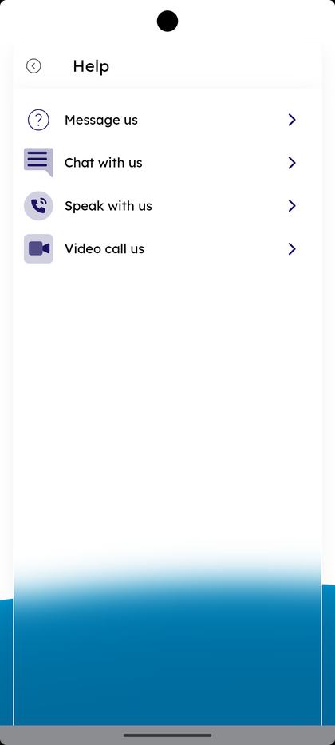
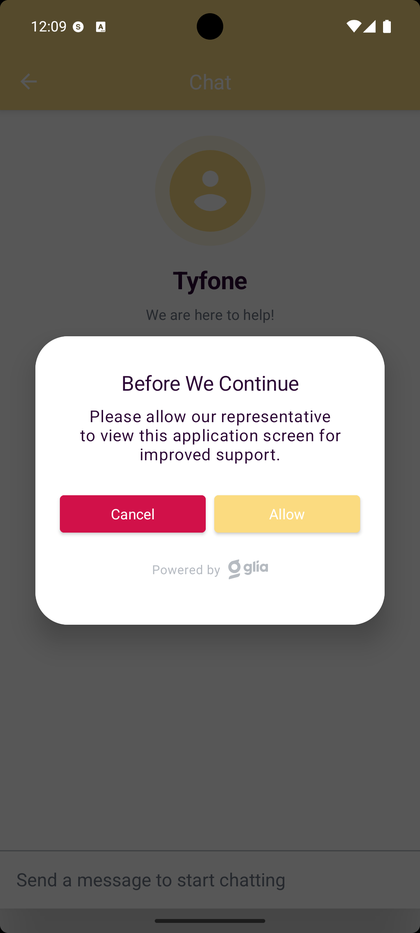
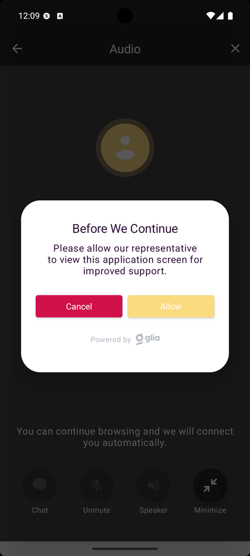
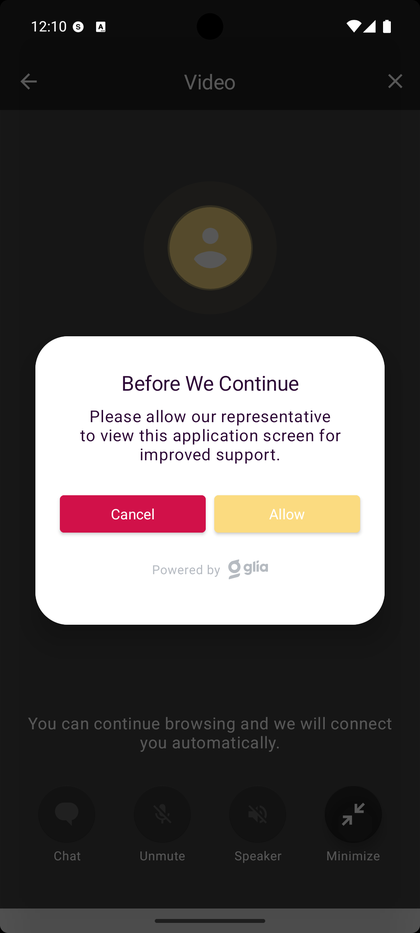

# Live Help — Chat, Speak, Video

_Summerville Mobile › Profile & Preferences › Live Help (Chat / Speak / Video)_

## Profile & Preferences: Live Help — Chat, Speak, Video

> The three live-agent channels on the Help screen — Chat with us, Speak with us, Video call us — each opens a Tyfone session and prompts Before We Continue to allow screen view for improved support.

**How to get here:** Side Menu (☰) → **Help** → **Chat with us** / **Speak with us** / **Video call us**

### Step-by-Step Workflow

#### Step 1: Open the Side Menu

Tap the **☰** hamburger icon at the top-right of any screen.

#### Step 2: Tap Help

In the Side Menu, tap **Help — Support**.

#### Step 3: Tap Chat with us

On the Help screen, tap **Chat with us**. The **Chat** screen opens with **Tyfone — We are here to help!** and *"Send a message to start chatting"* at the bottom.

#### Step 4: Allow Screen Share for Chat

A **Before We Continue** dialog appears: *"Please allow our representative to view this application screen for improved support."* Tap **Allow** to share the screen with the agent or **Cancel** to keep chatting without screen view.

#### Step 5: Tap Speak with us for an Audio Call

Back on the Help screen, tap **Speak with us**. The **Audio** screen opens with *"You can continue browsing and we will connect you automatically."* and bottom controls **Chat**, **Unmute**, **Speaker**, **Minimize**.

#### Step 6: Allow Screen Share for the Audio Call

A **Before We Continue** dialog appears with the same *"Please allow our representative to view this application screen for improved support."* message. Tap **Allow** or **Cancel**.

#### Step 7: Tap Video call us

Back on the Help screen, tap **Video call us**. The **Video** screen opens with the same wait message and bottom controls.

#### Step 8: Allow Screen Share for the Video Call

A **Before We Continue** dialog appears with the same *"Please allow our representative to view this application screen for improved support."* message. Tap **Allow** to share the screen during the video call or **Cancel** to keep video without screen view.

### Summary

All three live channels open a Tyfone session and immediately ask Before We Continue to allow screen view for improved support. Allow lets the representative see the same screen you're on, which speeds up troubleshooting. Cancel keeps the chat, audio, or video session running without screen sharing. The Audio and Video screens both show *"You can continue browsing and we will connect you automatically."* so the call connects in the background.

### Key Use Cases

* Quick written question to a live agent: **Chat with us** → **Allow** if the agent needs to see the screen.
* Walk-through of a flow that's hard to describe: **Speak with us** → **Allow** so the agent sees the same screen while you talk.
* Identity-verified high-risk request: **Video call us** → **Allow** for face-to-face plus screen view.
* Privacy-sensitive call: pick the right channel and **Cancel** the screen-share dialog — the session continues without screen view.
