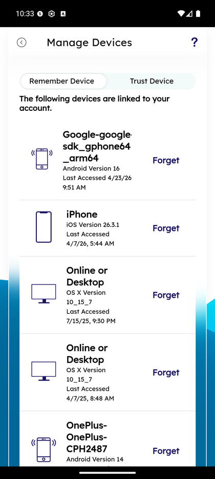

# Manage Devices

_Summerville Mobile › Profile & Preferences › Manage Devices_

## Profile & Preferences: Manage Devices

> The trusted-devices list — every phone, tablet, or browser that has logged into the account — with a one-tap **Forget** control and the Remember Device / Trust Device tab split.

**How to get here:** Side Menu (☰) → Settings → Personal Information → **Manage Devices**

### Step-by-Step Workflow

#### Step 1: Open Manage Devices

From the Side Menu → Personal Information → Manage Devices (or via direct deep-link from login security prompts), open the devices list. The top of the screen shows tabs **Remember Device** and **Trust Device**. The list below shows each linked device with platform icon, OS version, last-accessed timestamp, and a **Forget** action. Examples: *Google-google sdk_gphone64_arm64, Android Version 16, Last Accessed 4/23/26, 9:51 AM*; *iPhone, iOS Version 26.3.1*; *Online or Desktop, OS X*.

### Summary

Remembered devices skip the OTP step on login but still require password; trusted devices can biometric-log without OTP. The split lets members fine-tune the trade-off between friction and security per device — a personal phone gets Trust, a shared home tablet gets Remember only. **Forget** immediately revokes the device from both lists and forces full credential entry + OTP on the next attempt from that device, which is the correct action for a lost phone or a device the member no longer owns.

### Key Use Cases

* Member loses their phone: Forget that device from another device immediately; full login required for re-enrollment.
* Member wants to downgrade a shared family tablet from Trust → Remember: Forget, then re-pair as Remember-only on next login.
* Security audit: periodically review the list — any device the member doesn't recognize is a Forget + password-change immediately.
