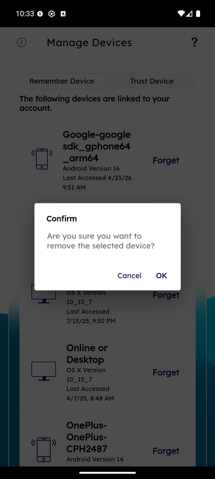

# Manage Devices

_Summerville Mobile › Profile & Preferences › Manage Devices_

## Profile & Preferences: Manage Devices

> The trusted-devices list — every phone, tablet, or browser that has logged into the account — with a one-tap **Forget** control, the Remember Device / Trust Device tab split, and a confirm dialog so a fat-finger can't accidentally revoke a real device.

**How to get here:** Side Menu (☰) → **Settings** → **Personal Information** → **Manage Devices**

### Step-by-Step Workflow

#### Step 1: Open the Side Menu

Tap the **☰** hamburger icon at the top-right of any screen.

#### Step 2: Tap Settings → Personal Information

In the Side Menu, tap **Settings**, then tap **Personal Information**.

#### Step 3: Tap Manage Devices

On the Personal Information menu, tap **Manage Devices — Update your linked devices** (the last row).

#### Step 4: Review Devices Across Remember / Trust Tabs

The top of the screen shows tabs **Remember Device** and **Trust Device**. Each linked device row shows platform icon, OS version, last-accessed timestamp, and a **Forget** action. Examples: *Google sdk_gphone64_arm64, Android Version 16, Last Accessed 4/23/26 9:51 AM*; *iPhone, iOS Version 26.3.1*; *Online or Desktop, OS X Version 10_15_7*.

#### Step 5: Confirm Forget With Dialog

Tap **Forget** on any row. A **Confirm** dialog appears: *"Are you sure you want to remove the selected device?"* with **Cancel** and **OK** buttons. Tap **OK** to revoke — the device is removed from both Remember and Trust lists immediately, and the next login from that device requires full credentials + OTP. Tap **Cancel** to keep it.

### Summary

Remembered devices skip the OTP step on login but still require password; trusted devices can biometric-log without OTP. The split lets you fine-tune the trade-off between friction and security per device — a personal phone gets Trust, a shared home tablet gets Remember only. **Forget** is final once you tap OK in the confirm dialog; the device is fully revoked and has to re-authenticate from scratch on the next login attempt. The confirm dialog is the guardrail against fat-finger forgetting of a primary device.

### Key Use Cases

* Member loses their phone: log in from another device → Manage Devices → Forget the lost device → OK in the confirm dialog. The lost device can no longer authenticate.
* Member wants to downgrade a shared family tablet from Trust → Remember: Forget on the Trust tab, then re-pair as Remember-only on next login.
* Security audit: periodically review the list — any device you don't recognize is a Forget + password-change immediately.
