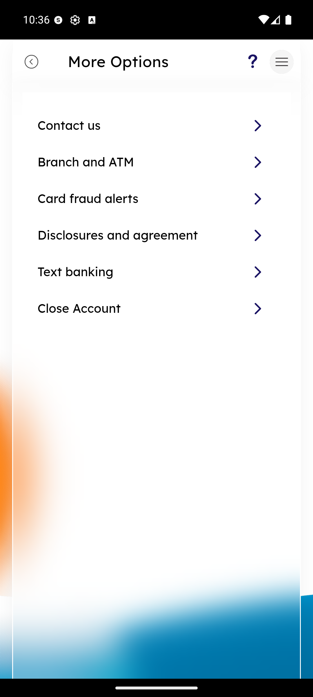

# More Options Menu

_Summerville Mobile › Profile & Preferences › More Options_

## Profile & Preferences: More Options Menu

> The secondary drill-down under Side Menu → More Options — grouped entries for Contact Us, Branch & ATM locator, Card fraud alerts, Disclosures, Text Banking, and Close Account.

**How to get here:** Side Menu (☰) → **More Options**

### Step-by-Step Workflow

#### Step 1: Open the Side Menu

Tap the **☰** hamburger icon at the top-right of any screen.

#### Step 2: Tap More Options

In the Side Menu, tap **More Options** (middle of the menu list).

#### Step 3: Pick the Action You Need

The More Options screen shows six rows:
- **Contact us** — secure message / phone / chat entry.
- **Branch and ATM** — locator with map.
- **Card fraud alerts** — toggles and fraud-team contact.
- **Disclosures and agreement** — legal documents viewer.
- **Text banking** — SMS-banking enrollment.
- **Close Account** — the same policy + call-us routing as the in-app Account Closure flow.

Tap the row for the action you need.

### Summary

More Options is where lower-frequency-but-critical capabilities live — members don't visit it often, but when they do, they need clear routing to the right team. Card fraud alerts and Close Account are the highest-stakes entries and both escalate off-app (fraud team number, closure call). Text banking is the one outlier — it's a self-service enrollment flow that completes in-app without external routing.

### Key Use Cases

* Member reporting possible card fraud: More Options → Card fraud alerts → contact-team number and self-serve freeze.
* Traveling member locating a nearby branch: More Options → Branch and ATM → map view.
* Member reviewing disclosures for a new product: More Options → Disclosures and agreement.
