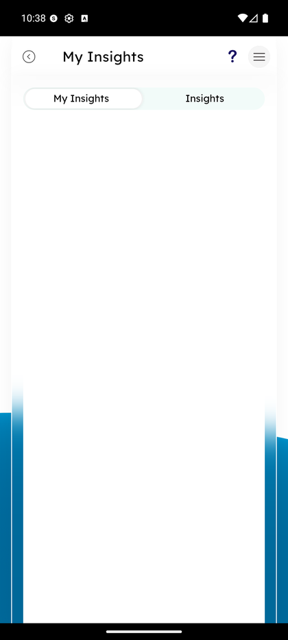

# My Insights

_Summerville Mobile › Profile & Preferences › My Insights_

## Profile & Preferences: My Insights (Personal Finance Manager)

> Two-tab personal-finance view — **My Insights** for your own custom-tracked financial pulses, and **Insights** for the credit union's shared insights (rate changes, savings tips, etc.).

**How to get here:** Side Menu (☰) → **My Insights — Personal Finance Manager**

### Step-by-Step Workflow

#### Step 1: Open the Side Menu

Tap the **☰** hamburger icon at the top-right of any screen.

#### Step 2: Tap My Insights

In the Side Menu, scroll to **My Insights — Personal Finance Manager** and tap it. The My Insights screen loads with two tabs at the top: **My Insights** (active) and **Insights**.

#### Step 3: My Insights Tab — Your Tracked Pulses

The **My Insights** tab shows your own configured insights — savings goals, spending pulses, balance trends. When the tab is empty (a fresh account), it shows blank space prompting you to add your first insight via Help or to wait for the system to surface auto-generated insights based on your activity.

#### Step 4: Insights Tab — Shared Credit-Union Content

Tap the **Insights** tab to see content from the credit union — rate-change announcements, seasonal savings tips, financial-wellness content. This is push content, not member-configured.

### Summary

My Insights is the Personal Finance Manager surface — it's where Summerville surfaces auto-generated financial nudges (low-balance pulses, spending-spike alerts) alongside curated content from the credit union. The two-tab split keeps "your data" separate from "their content." On a fresh account both tabs may be empty until you have transaction history for the system to analyze.

### Key Use Cases

* Member checking what spending pulses have been generated for them: My Insights tab.
* Member browsing credit-union content (rate-change, savings tips): Insights tab.
* Member with a brand new account: both tabs are empty until ~30 days of activity has been analyzed.
