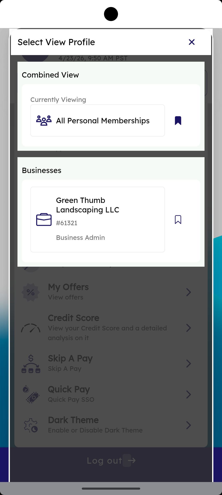

# Profile Switcher — Personal & Business

_Summerville Mobile › Profile & Preferences › Profile Switcher_

## Profile & Preferences: Profile Switcher — Personal & Business

> One login, two contexts — members with a consumer profile and a business membership switch the whole app context (accounts, transfers, entitlements) from a single bottom-sheet selector.

**How to get here:** Side Menu (☰) → tap the profile card at the top → **Switch profile**

### Step-by-Step Workflow

#### Step 1: Select View Profile

The **Select View Profile** sheet shows the Combined View toggle (**All Personal Memberships** currently viewing) and a Businesses section listing each business membership the member has been granted a role on — e.g., **Green Thumb Landscaping LLC (#61321) — Business Admin**. Tap a business to switch the entire app into that business context; everything below (My Offers, Credit Score, Skip A Pay, Quick Pay, Dark Theme) reflects the new context after the switch.

### Summary

The switcher is the authoritative way to move between consumer and business contexts without logging out — entitlements, account filters, and menu items all recompute on switch, so a member acting as a Business Admin on the LLC context sees business-banking features (role management, approvals, bulk file upload) that aren't visible from the personal context. The bookmark icons mark a default view; the switcher remembers the last context across sessions.

### Key Use Cases

* Owner-operator uses personal account in the morning, LLC at the office: switch context once, app remembers until next switch.
* CPA with read-only role on a client's business: sees the business in the switcher, but the entitlements gate write actions.
* Member wants to exit business context quickly: tap Combined View → All Personal Memberships to return to consumer default.
