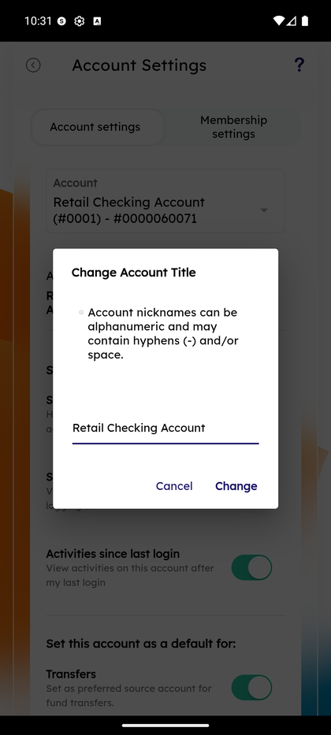

# Settings & Preferences

_Summerville Mobile › Profile & Preferences › Settings & Preferences_

## Profile & Preferences: Settings & Preferences

> The preference tree for account-level toggles, security settings, and display preferences. Reached through the Side Menu.

**How to get here:** Side Menu (☰) → **Settings**

### Step-by-Step Workflow

#### Step 1: Open the Side Menu

Tap the **☰** hamburger icon at the top-right of any screen. The Side Menu drawer slides in.

#### Step 2: Tap Settings

In the Side Menu, tap **Settings — Account and security settings**. This is the first item below the Enable alerts toggle.

#### Step 3: Review Account Settings and Membership Settings Tabs

The Settings screen opens with two tabs at the top: **Account settings** (default) and **Membership settings**. Account settings holds per-account preferences (rename, visibility, sneak peek, default transfer source); Membership settings holds read-only ownership and beneficiary information.

### Summary

Settings is the one-stop for the preference tuning most members do once and forget — account nicknames, visibility toggles, sneak-peek access, default transfer source, and membership review. None of these settings affect transactional behavior or security posture; they're purely configuration. Keeping them in one place means you can direct any "how do I change X display" question here without needing to know the specific path for each setting. See **Account Settings & Beneficiaries** for the per-account editable toggles.

### Key Use Cases

* Member wants to rename checking to something friendlier: Account settings → Rename.
* Member wants to confirm beneficiaries are on file: Membership settings.
* Member wants a specific account pre-selected as the transfer source: Account settings → Set as default for → Transfers.
